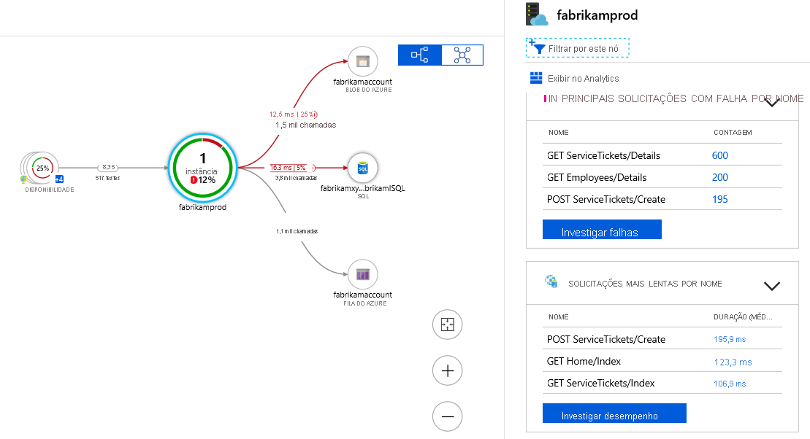

# Desenvolver soluções de computação do Azure (25–30%)

## Implementar soluções conteinerizadas

- [ ] ***Criar e gerenciar imagens de contêiner para soluções***
- [ ] ***Publicar uma imagem no Registro de Contêiner do Azure.***
- [ ] ***Executar contêineres usando a Instância de Contêiner do Azure***
- [ ] ***Criar soluções usando os Aplicativos de Contêiner do Azure***

- O Azure oferece diferentes opções de contêineres
- você pode optar por implantar seu aplicativo da web em um contêiner Docker ao criar o recurso do aplicativo
- você pode criar um recurso Kubernetes, que é complexo de configurar e usar, mas é poderoso e pode ser bem dimensionado
- você pode criar uma instância de contêiner do Azure, que é uma maneira simples e rápida de colocar um contêiner em execução, mas não é tão poderosa quanto o Kubernetes e não é escalonável
- você pode criar seu projeto de aplicativo da web em uma imagem e enviá-lo para um diretório diretamente do VS
- você pode então implantar essas imagens em um aplicativo Web do Azure, uma VM com Docker em execução, uma instância de contêiner do Azure, etc.
- Imagem Docker: um pacote de sistema operacional, dependências e código que pode ser usado para criar e executar uma instância de contêiner

### Registro de contêiner do Azure(ACR)

O ARC (Registro de Contêiner do Azure) é um serviço de registro do Docker gerenciado e privado com base no Docker Registry 2.0 de software livre. Criar e manter registros de contêiner do Azure para armazenar e gerenciar suas imagens privadas de contêiner Docker.

| Camada   | Descrição                                                                                                                                                                                                                                                                                                                                                                                                                                                                                  |
| -------- | -------------------------------------------------------------------------------------------------------------------------------------------------------------------------------------------------------------------------------------------------------------------------------------------------------------------------------------------------------------------------------------------------------------------------------------------------------------------------------------------- |
| Basic    | Um ponto de entrada de otimização de custo para desenvolvedores aprendendo sobre o Registro de Contêiner do Azure. Os registros Básicos têm os mesmos recursos de programação que os Standard e Premium (como a integração de autenticação do Microsoft Entra, exclusão de imagense webhooks). No entanto, o armazenamento incluído e a taxa de transferência de imagem são mais apropriados para cenários de uso mais baixos.                                               |
| Standard | Os registros Standard oferecem os mesmos recursos do Básico, com maior armazenamento incluído e taxa de transferência de imagem. Registros Standard devem atender às necessidades da maioria dos cenários de produção.                                                                                                                                                                                                                                                                |
| Premium  | Os registros Premium fornecem a maior quantidade de armazenamento incluído e operações simultâneas, permitindo cenários de alto volume. Além de uma taxa de transferência de imagens mais alta, o Premium adiciona recursos como a replicação geográfica para gerenciar um só registro em várias regiões, a relação de confiança de conteúdo para a assinatura de marca de imagem e o link privado com pontos de extremidade privados para restringir o acesso ao registro. |

- um local para publicar imagens de contêineres privados
- DockerHub, por outro lado, é um registro público
- um registro de contêiner é um recurso

* **Redundância de zona:** a redundância de zona, um recurso da camada de serviço Premium, usa zonas de disponibilidade do Azure para replicar seu registro para um mínimo de três zonas separadas em cada região habilitada.

**DockerFile**

```powershell
# Use the .NET 6 runtime as a base image
FROM mcr.microsoft.com/dotnet/runtime:6.0

# Set the working directory to /app
WORKDIR /app

# Copy the contents of the published app to the container's /app directory
COPY bin/Release/net6.0/publish/ .

# Expose port 80 to the outside world
EXPOSE 80

# Set the command to run when the container starts
CMD ["dotnet", "MyApp.dll"]
```

Comand

```powershell
az acr task create --registry $ACR_NAME --name example1 --context https://github.com/$GIT_USER/acr-build-helloworld-node.git#main --file taskmulti.yaml --git-access-token $GIT_PAT
```

### Instância de contêiner do Azure (ACI)

As ACI (Instâncias de Contêiner do Azure) oferecem a maneira mais rápida e simples de executar um contêiner no Azure sem precisar gerenciar nenhuma máquina virtual ou adotar um serviço de nível superior.

- uma instância de contêiner é um recurso no qual uma imagem de contêiner implantada é executada
- A ACI é mais rápida de implantar do que um serviço de aplicativo, mas os serviços de aplicativo têm mais recursos (backups, escalabilidade, etc.)

```powershell
az container create --resource-group az204-aci-rg \
    --name mycontainer \
    --image mcr.microsoft.com/azuredocs/aci-helloworld \
    --ports 80 \
    --dns-name-label $DNS_NAME_LABEL --location <myLocation>
```

#### Grupos de contêineres

O recurso de nível superior em Instâncias de Contêiner do Azure é um  *grupo de contêineres* . Um grupo de contêineres é uma coleção de contêineres que são agendados no mesmo computador host. Os contêineres de um grupo de contêineres compartilham ciclo de vida, recursos, rede local e volumes de armazenamento. Conceitualmente, ele é semelhante a um *pod* no Kubernetes.


Grupos com vários contêineres são úteis nos casos em que você deseja dividir apenas uma tarefa funcional em várias imagens de contêiner. Essas imagens podem ser fornecidas por equipes diferentes e têm outros requisitos de recursos.

Os exemplos de uso podem incluir:

* Um contêiner que atende a um aplicativo Web e um contêiner efetuando pull do conteúdo mais recente do controle do código-fonte.
* Um contêiner de aplicativo e um contêiner de log. O contêiner de log coleta logs e métricas de saída do aplicativo principal e grava-as em armazenamento de longo prazo.
* Um contêiner de aplicativo e um contêiner de monitoramento. O contêiner de monitoramento faz uma solicitação periódica ao aplicativo para garantir que ele esteja em execução e respondendo corretamente e emite um alerta em caso negativo.
* Um contêiner de front-end e um contêiner de back-end. O de front-end pode servir a um aplicativo Web, com o de back-end executando um serviço para recuperar dados.

| Política de reinicialização | Descrição                                                                                                                                                                                                                            |
| ------------------------------ | -------------------------------------------------------------------------------------------------------------------------------------------------------------------------------------------------------------------------------------- |
| `Always`                     | Os contêineres no grupo de contêineres sempre são reiniciados. Essa é a configuração **padrão** aplicada quando nenhuma política de reinicialização é especificada na criação do contêiner.                       |
| `Never`                      | Os contêineres no grupo de contêineres nunca são reiniciados. Os contêineres são executados no máximo uma vez.                                                                                                                   |
| `OnFailure`                  | Os contêineres no grupo de contêineres são reiniciados somente quando o processo executado no contêiner falha (quando ele termina com um código de saída diferente de zero). Os contêineres são executados pelo menos uma vez. |

```powershell
az container create \
    --resource-group myResourceGroup \
    --name mycontainer \
    --image mycontainerimage \
    --restart-policy OnFailure
```

> **Observação**
>
> Atualmente, os grupos com vários contêineres dão suporte apenas aos contêineres do Linux. Para contêineres do Windows, as Instâncias de Contêiner do Azure dão suporte apenas à implantação de uma única instância.

Comando para utilizar variaveis

```powershell
az container create \
    --resource-group myResourceGroup \
    --name mycontainer2 \
    --image mcr.microsoft.com/azuredocs/aci-wordcount:latest 
    --restart-policy OnFailure \
    --environment-variables 'NumWords'='5' 'MinLength'='8'\
```

**Limitações**

* O compartilhamento de Arquivos do Azure só pode ser montado para contêineres do Linux.
* A montagem de volume de compartilhamento de arquivos do Azure requer que o contêiner Linux seja executado como  *raiz* .
* As montagens de volume de compartilhamento de Arquivos do Azure são limitadas ao suporte a CIFS.

**Exemplo montar volumes**

```powershell
az container create --resource-group $ACI_PERS_RESOURCE_GROUP --name hellofiles 
--image mcr.microsoft.com/azuredocs/aci-hellofiles --dns-name-label aci-demo 
--ports 80 --azure-file-volume-account-name $ACI_PERS_STORAGE_ACCOUNT_NAME 
--azure-file-volume-account-key $STORAGE_KEY 
--azure-file-volume-share-name $ACI_PERS_SHARE_NAME --azure-file-volume-mount-path /aci/logs/
```

### Aplicativos de Contêiner do Azure

Permitem que você execute microsserviços e aplicativos conteinerizados em uma plataforma sem servidor que é executada sobre Serviço de Kubernetes do Azure. Os tipos de uso comuns dos Aplicativos de Contêiner do Azure incluem:

* Implantação de pontos de extremidade de API
* Hospedagem de aplicativos de processamento em segundo plano
* Manipulação de processamento controlado por eventos
* Execução de microsserviços

Você pode:

* Executar várias revisões de contêiner e gerenciar o ciclo de vida do aplicativo de contêiner.
* Dimensionar automaticamente os aplicativos com base em qualquer gatilho de escala com suporte do KEDA. A maioria dos aplicativos pode ser dimensionada como zero (os aplicativos que são dimensionados em carga de CPU ou de memória não podem ser dimensionados como zero).
* Habilitar a entrada HTTPS sem precisar gerenciar outra infraestrutura do Azure.
* Dividir o tráfego entre várias versões de um aplicativo para implantações azuis/verdes e cenários de teste A/B.
* Usar a entrada interna e a descoberta de serviço para pontos de extremidade somente internos seguros com a descoberta de serviço interna baseada em DNS.
* Crie microsserviços com [Dapr](https://docs.dapr.io/concepts/overview/) e acesse seu valioso conjunto de APIs.
* Executar contêineres de qualquer registro, público ou privado, incluindo o Docker Hub e o ACR (Registro de Contêiner do Azure).
* Usar a extensão da CLI do Azure, o portal do Azure ou os modelos do ARM para gerenciar os aplicativos.
* Fornecer uma rede virtual existente ao criar um ambiente para os aplicativos de contêiner.
* Gerenciar os segredos com segurança diretamente no aplicativo.
* Monitorar logs usando o Azure Log Analytics.

Os motivos para implantar aplicativos de contêiner no mesmo ambiente incluem situações em que você precisa:

* Gerenciar serviços relacionados
* Implantar aplicativos diferentes na mesma rede virtual
* Instrumentar aplicativos [Dapr](https://docs.dapr.io/concepts/overview/) que se comunicam por meio da API de invocação de serviço do Dapr
* Fazer com que os aplicativos compartilhem a mesma configuração de Dapr
* Fazer com que os aplicativos compartilhem o mesmo workspace do Log Analytics

Os motivos para implantar aplicativos de contêiner em ambientes diferentes incluem situações em que você deseja garantir:

* Dois aplicativos nunca compartilham os mesmos recursos de computação
* Dois aplicativos Dapr não se comunicam por meio da API de invocação de serviço do Dapr

**Exemplo de criação**

```powershell

//Instale a extensão dos Aplicativos de Contêiner do Azure para a CLI.
az extension add --name containerapp --upgrade

//Remova o namespace Microsoft.App.
az provider register --namespace Microsoft.App

//Registre o provedor Microsoft.OperationalInsights para o workspace do Log Analytics do Azure Monitor se ele ainda não tiver sido usado.
az provider register --namespace Microsoft.OperationalInsights

//Defina as variáveis de ambiente 
myRG=az204-appcont-rg
myLocation=<location>
myAppContEnv=az204-env-$RANDOM

// grupo de recursos para seu aplicativo de contêiner
az group create \
    --name $myRG \
    --location $myLocation

//Crie um ambiente
az containerapp env create \
    --name $myAppContEnv \
    --resource-group $myRG \
    --location $myLocation

//Implante uma imagem de contêiner de aplicativo 
az containerapp create \
    --name my-container-app \
    --resource-group $myRG \
    --environment $myAppContEnv \
    --image mcr.microsoft.com/azuredocs/containerapps-helloworld:latest \
    --target-port 80 \
    --ingress 'external' \
    --query properties.configuration.ingress.fqdn

//Ao definir --ingress como external, você torna as solicitações públicas disponíveis do aplicativo de contêiner. O comando retorna um link para acessar seu aplicativo.

```

Os Aplicativos de Contêiner do Azure gerenciam os detalhes do Kubernetes e orquestração de contêineres para você. Os contêineres nos Aplicativos de Contêiner do Azure podem usar o runtime, a linguagem de programação ou a pilha de desenvolvimento de sua preferência.


Exemplo de modelo ARM

```powershell
"containers": [
  {
       "name": "main",
       "image": "[parameters('container_image')]",
    "env": [
      {
        "name": "HTTP_PORT",
        "value": "80"
      },
      {
        "name": "SECRET_VAL",
        "secretRef": "mysecret"
      }
    ],
    "resources": {
      "cpu": 0.5,
      "memory": "1Gi"
    },
    "volumeMounts": [
      {
        "mountPath": "/myfiles",
        "volumeName": "azure-files-volume"
      }
    ]
    "probes":[
        {
            "type":"liveness",
            "httpGet":{
            "path":"/health",
            "port":8080,
            "httpHeaders":[
                {
                    "name":"Custom-Header",
                    "value":"liveness probe"
                }]
            },
            "initialDelaySeconds":7,
            "periodSeconds":3
// file is truncated for brevity
```

Os Aplicativos de Contêiner do Azure têm as seguintes limitações:

* **Contêineres com privilégios** : os Aplicativos de Contêiner do Azure não podem executar contêineres com privilégios. Se o programa tentar executar um processo que requer acesso raiz, o aplicativo dentro do contêiner apresentará um erro de runtime.
* **Sistema operacional** : são necessárias imagens de contêiner baseadas em Linux (`linux/amd64`).

> **Observação**
>
> Os Aplicativos de Contêiner não dão suporte à integração do Azure Key Vault. Em vez disso, habilite a identidade gerenciada no aplicativo de contêiner e use o SDK do Key Vault em seu aplicativo para acessar segredos.

No exemplo abaixo, uma cadeia de conexão para uma conta de armazenamento de fila é declarada no parâmetro `--secrets`. O valor de queue-connection-string é proveniente de uma variável de ambiente chamada `$CONNECTION_STRING`.

```powershell
az containerapp create \
  --resource-group "my-resource-group" \
  --name queuereader \
  --environment "my-environment-name" \
  --image demos/queuereader:v1 \
  --secrets "queue-connection-string=$CONNECTION_STRING"
```

## Implementar Aplicativos Web do Serviço de Aplicativo do Azure

- [ ] ***Criar um Aplicativo de API do Serviço de Aplicativo do Azure***
- [ ] ***Habilitar o registro em log de diagnóstico***
- [ ] ***Implantar o código em um aplicativo Web***
- [ ] ***Definir configurações de aplicativo Web, incluindo Transport Layer Security (TLS), configurações de API e cadeias de conexão***
- [ ] ***Implementar o dimensionamento automático***

- O Serviço de Aplicativo no Linux não é compatível com o tipo de preço Compartilhado.
- Quando for implantar seu aplicativo Web, ao executar na camada Standard ou superior do Plano do Serviço de Aplicativo do Azure, você poderá usar um slot de implantação separado em vez do slot de produção padrão
- um aplicativo da web reside dentro de um plano de serviço de aplicativo
- ACU: unidade de computação do Azure
- WebJobs

  - uma tarefa em segundo plano anexada a um aplicativo da web
  - funciona de acordo com um cronograma
  - como uma função do Azure acionada por temporizador
- slots de implantação

  - uma maneira de hospedar várias instâncias de um aplicativo em uma única instância de aplicativo da web
- Dica CLI: use `get-command *{search term}*` para procurar um comando
- Kudu

  - ao publicar seu aplicativo da web, você obtém um URL para o site Kudu do seu aplicativo
  - o site Kudu fornece detalhes sobre seu aplicativo
    - arquivos
    - fluxos de log
    - scripts de implantação
  - no site você pode usar um shell Bash ou PowerShell na nuvem para navegar nos diretórios
- Criação de Slots de implantação

  - Criar Ressource Group
  - Criar Service Plan
  - Criar WebApp
  - Criar Slot
- Existem dois tipos de identidades gerenciadas:

  * Atribuído pelo sistema: alguns serviços do Azure permitem-lhe ativar uma identidade gerida diretamente numa instância de serviço. Quando você habilita uma identidade gerenciada atribuída ao sistema, é criada uma identidade no Azure AD que está vinculada ao ciclo de vida dessa instância de serviço. Assim, quando o recurso é eliminado, o Azure elimina automaticamente a identidade para si. Por design, apenas esse recurso do Azure pode usar esta identidade para solicitar tokens do Azure AD.
  * Atribuído pelo utilizador: também pode criar uma identidade gerida como um recurso autónomo do Azure. Você pode criar uma identidade gerenciada atribuída ao usuário e atribuí-la a uma ou mais instâncias de um serviço do Azure. No caso de identidades geridas atribuídas pelo utilizador, a identidade é gerida separadamente dos recursos que a utilizam.
- O *tipo de preço* de um plano de serviço de aplicativo determina quais recursos do serviço de aplicativo que você obtém e quanto você paga pelo plano. Há algumas categorias de tipos de preços:

  * **Computação compartilhada** : **grátis** e  **compartilhada** , os dois tipos base, executam um aplicativo na mesma máquina virtual do Azure como outros aplicativos do serviço de aplicativo, incluindo aplicativos de outros clientes. Essas camadas alocam cotas de CPU a cada aplicativo que é executado nos recursos compartilhados e os recursos não podem ser escalados horizontalmente.
  * **Computação dedicada** : as camadas  **Básica** ,  **Standard** ,  **Premium** , **PremiumV2** e **PremiumV3** executam os aplicativos nas VMs dedicadas do Azure. Somente os aplicativos no mesmo plano do serviço de aplicativo compartilham os mesmos recursos de computação. Quanto maior o nível, mais instâncias de máquina virtual estão disponíveis para a sua expansão.
  * **Isolado** : as camadas **Isolada** e **IsoladaV2** executam VMs do Azure em Redes Virtuais do Azure dedicadas. Ele fornece isolamento de rede na parte superior do isolamento de computação para seus aplicativos. Ele fornece a capacidade máxima de expansão.
- Um plano de serviço de aplicativo ou app service plan **define um conjunto de recursos de computação para um aplicativo Web ser executado** . Quando você cria um plano de serviço de aplicativo em uma determinada região (por exemplo, Europa Ocidental), um conjunto de recursos de computação é criado para esse plano nessa região

Os Planos de Serviço de Aplicativo do Azure são um plano de serviço no Azure para hospedagem de aplicativos Web. Ele fornece uma maneira de alocar recursos, dimensionar e gerenciar o ambiente no qual os aplicativos são executados. Aqui estão alguns conceitos-chave:

Plano de Serviço de Aplicativo: Este é um contêiner lógico que define um conjunto de aplicativos Web do Serviço de Aplicativo que compartilham os mesmos recursos de computação e definições de configuração. O Plano de Serviço de Aplicativo inclui recursos de computação (como instâncias de máquinas virtuais), sistemas operacionais, recursos de rede, etc. Um Plano de Serviço de Aplicativo pode hospedar um ou mais aplicativos Web, aplicativos API, aplicativos móveis ou serviços de back-end.

Aumentar/diminuir escala: ao alterar o tamanho do Plano de Serviço de Aplicativo, você pode dimensionar o aplicativo verticalmente. Isso significa que você pode ajustar o tamanho dos recursos computacionais de acordo com as necessidades da sua aplicação, por exemplo, atualizar de Compartilhado para Básico, Padrão, Premium, etc.

Scale Out/In: Ao alterar o número de instâncias, você pode dimensionar seu aplicativo horizontalmente. Isso significa que você pode aumentar ou diminuir o número de instâncias de máquinas virtuais executando seu aplicativo em resposta a alterações no tráfego e na carga.

Modelo de preços: os Planos de Serviço de Aplicativo têm diferentes níveis de preços, cada um oferecendo diferentes recursos e recursos de computação. A camada Compartilhada é adequada para desenvolvimento e testes de baixo tráfego, enquanto as camadas Standard, Premium e Advanced Enhanced são adequadas para aplicações de produção em maior escala.

Regiões e disponibilidade específicas: os Planos de Serviço de Aplicações podem ser criados em regiões específicas do Azure para garantir alta disponibilidade e baixa latência para a sua aplicação.

No geral, os Planos de Serviço de Aplicativos do Azure fornecem uma maneira conveniente de gerenciar e ajustar os recursos de computação para atender às necessidades de desempenho e escalabilidade do seu aplicativo. Ao utilizar Planos de Serviço de Aplicações, pode gerir eficazmente os recursos com base nas necessidades da sua aplicação, ao mesmo tempo que minimiza a complexidade de manutenção e configuração.

Comandos para criar recursos

```powershell

//Realiza o Login
login az

//Cria um grupo de recursos
az group create --location westeurope --name (nome do seu grupo)

//Criar o app service plan
az appservice plan create --name (nome do seu projeto)--resource-group (nome escolhido no passo anterior)--sku S1

//cria seu webapp
az webapp create --name (nome do app)--resource-group (nome do grupo de recursos)--plan (nome do plano criado no passo anterior)

//publicação do recurso
az webapp deployment source config --name (nome do seu projeto)--resource-group (seu resource group)--repo-url (url do seu projeto no git) --branch master --manual-integration

```

## Implementar Funções do Azure

* [ ] Criar e configurar um aplicativo do Azure Functions
* [ ] Implementar associações de entrada e de saída
* [ ] Implementar gatilhos função usando operações de dados, temporizadores e webhooks

O Azure **Functions** é uma solução sem servidor que permite que você escreva menos código, mantenha menos infraestrutura e economize nos custos. Em vez de se preocupar com a implantação e manutenção de servidores, a infraestrutura de nuvem fornece todos os recursos atualizados necessários para manter seus aplicativos em execução

|                        | Azure Functions                                                                                                      | Aplicativos Lógicos                                                                                                                 |
| ---------------------- | -------------------------------------------------------------------------------------------------------------------- | ------------------------------------------------------------------------------------------------------------------------------------ |
| Desenvolvimento        | Primeiro o código (obrigatória)                                                                                    | Primeiro o designer (declarativa)                                                                                                    |
| Conectividade          | Cerca de doze tipos internos de associação + possibilidade de escrita de código para associações personalizadas | Grande conjunto de conectores + Enterprise Integration Pack para cenários de B2B + possibilidade de criar conectores personalizados |
| Ações                | Cada atividade é uma função do Azure. Escrever código para funções de atividade                                | Grande conjunto de ações predefinidas                                                                                              |
| Monitoring             | Azure Application Insights                                                                                           | Portal do Azure, logs do Azure Monitor                                                                                               |
| Gerenciamento          | API REST, Visual Studio                                                                                              | Portal do Azure, API REST, PowerShell, Visual Studio                                                                                 |
| Contexto de execução | É executado no Azure ou localmente                                                                                  | É executado no Azure, localmente ou no local                                                                                        |


Como no Azure Functions, o WebJobs do Serviço de Aplicativo do Azure com o SDK do WebJobs é um serviço de integração com prioridade de código que foi projetado para desenvolvedores. Ambos são criados no Serviço de Aplicativo do Azure e dão suporte a recursos como integração de controle de origem, autenticação e monitoramento com integração do Application Insights.

O Azure Functions se baseia no SDK do WebJobs e, portanto, compartilha muitos dos mesmos gatilhos de evento e conexões com outros serviços do Azure. Estes são alguns fatores a serem considerados quando você escolher entre o Azure Functions e o WebJobs com o SDK do WebJobs:

|                                                                   | Funções                                                                                                                                                                                                                                                       | WebJobs com o SDK do WebJobs                                                                                                                                                                                  |
| ----------------------------------------------------------------- | --------------------------------------------------------------------------------------------------------------------------------------------------------------------------------------------------------------------------------------------------------------- | ------------------------------------------------------------------------------------------------------------------------------------------------------------------------------------------------------------- |
| Modelo de aplicativo sem servidor com dimensionamento automático | Sim                                                                                                                                                                                                                                                             | No                                                                                                                                                                                                            |
| Desenvolver e testar no navegador                                 | Sim                                                                                                                                                                                                                                                             | No                                                                                                                                                                                                            |
| Preço de pagamento por uso                                       | Sim                                                                                                                                                                                                                                                             | No                                                                                                                                                                                                            |
| Integração com os Aplicativos Lógicos                          | Sim                                                                                                                                                                                                                                                             | No                                                                                                                                                                                                            |
| Eventos de gatilho                                                | Temporizador``Blobs e filas do Armazenamento do Azure``Filas e tópicos do Barramento de Serviço do Azure``Azure Cosmos DB``Hubs de eventos do Azure``HTTP/WebHook (GitHub``Slack)``Grade de Eventos do Azure | Temporizador``Blobs e filas do Armazenamento do Azure``Filas e tópicos do Barramento de Serviço do Azure``Azure Cosmos DB``Hubs de eventos do Azure``Sistema de arquivos |


O plano de hospedagem que você escolher ditará os seguintes comportamentos:

* Como o aplicativo de funções é dimensionado.
* Os recursos disponíveis para cada instância do aplicativo de funções.
* Suporte para funcionalidades avançadas, como conectividade à Rede Virtual do Azure.


| Plano                      | Vantagens                                                                                                                                                                                                                                                                                                |
| -------------------------- | -------------------------------------------------------------------------------------------------------------------------------------------------------------------------------------------------------------------------------------------------------------------------------------------------------- |
| **Plano de consumo** | Este é o plano de hospedagem padrão. Ele escala automaticamente e você paga apenas pelos recursos de computação quando suas funções estiverem em execução. As instâncias do host do Functions são adicionadas e removidas de maneira dinâmica com base no número de eventos de entrada.     |
| **Plano Premium**    | Escala automaticamente com base na demanda usando trabalhos pré-configurados que executam aplicativos sem atraso após estarem ociosos, é executado em instâncias mais poderosas e se conecta a redes virtuais.                                                                                       |
| **Plano dedicado**   | Execute suas funções em um plano do Serviço de Aplicativo com taxas regulares do Plano do Serviço de Aplicativo. Melhor para cenários de execução longa em que o[Durable Functions](https://learn.microsoft.com/pt-br/azure/azure-functions/durable/durable-functions-overview) não pode ser usado. |


| Plano                      | Escalar horizontalmente                                                                                                                                                                                                                                                                                            | Número máximo de instâncias |
| -------------------------- | ------------------------------------------------------------------------------------------------------------------------------------------------------------------------------------------------------------------------------------------------------------------------------------------------------------------ | ------------------------------ |
| **Plano de Consumo** | Controlado por evento. Escale horizontalmente de forma automática, mesmo durante períodos de carga alta. A infraestrutura do Azure Functions escala os recursos de CPU e memória adicionando mais instâncias do host do Functions de acordo com o número de eventos de gatilho de entrada.                    | Windows: 200, Linux: 100       |
| **Plano Premium**    | Controlado por evento. Escale horizontalmente de forma automática, mesmo durante períodos de carga alta. A infraestrutura do Azure Functions escala os recursos de CPU e memória adicionando mais instâncias do host do Functions de acordo com o número de eventos nos quais suas funções são disparadas. | Windows: 100, Linux: 20-100    |
| **Plano dedicado**   | Dimensionamento manual/automático                                                                                                                                                                                                                                                                                 | 10-20                          |
| **ASE**              | Dimensionamento manual/automático                                                                                                                                                                                                                                                                                 | 100                            |
| **Kubernetes**       | Dimensionamento automático controlado por eventos para clusters Kubernetes usando KEDA.                                                                                                                                                                                                                           | Varia de acordo com o cluster  |


A seguinte tabela mostra os valores padrão e máximo (em minutos) para planos específicos:


| Plano            | Padrão | Máximo   |
| ---------------- | ------- | --------- |
| Plano de consumo | 5       | 10        |
| Plano Premium    | 30      | Ilimitado |
| Plano dedicado   | 30      | Ilimitado |

Em qualquer plano, um aplicativo de funções requer uma conta geral de Armazenamento do Microsoft Azure, que dá suporte para o Armazenamento de Blobs, Filas, Arquivos e Tabelas do Azure. Isso ocorre porque o Functions depende do Armazenamento do Microsoft Azure para operações como o gerenciamento de gatilhos e execuções de funções de registro em log, mas algumas contas de armazenamento não dão suporte a filas e tabelas.


Nos planos Consumo e Premium, o Azure Functions escala os recursos de CPU e memória ao adicionar mais instâncias do host do Functions. O número de instâncias é determinado no número de eventos que disparam uma função.


Uma **função** contém duas partes importantes: seu código, que pode estar escrito em várias linguagens e ter alguma configuração e o arquivo  *function.json* . Para linguagens compiladas, o arquivo de configuração é gerado automaticamente com base nas anotações no código. Para linguagens de script, você deve fornecer seu próprio arquivo de configuração.


A propriedade `bindings` é onde você configura gatilhos e associações. Cada associação compartilha algumas configurações e outras que são específicas de determinado tipo de associação.


```json
{
    "disabled":false,
    "bindings":[
        // ... bindings here
        {
            "type": "bindingType",
            "direction": "in",
            "name": "myParamName",
            // ... more depending on binding
        }
    ]
}
```


Todas as associações exigem as seguintes configurações:


| Propriedade   | Tipos  | Comentários                                                                                                                    |
| ------------- | ------ | ------------------------------------------------------------------------------------------------------------------------------- |
| `type`      | string | Nome da associação. Por exemplo,`queueTrigger`.                                                                             |
| `direction` | string | Indica se a associação é para receber dados na função ou enviar dados a partir da função. Por exemplo,`in` ou `out`. |
| `name`      | string | O nome que é usado para os dados associados na função. Por exemplo,`myQueue`.                                              |


Para idiomas que são digitados dinamicamente como JavaScript, use a propriedade `dataType` no arquivo  *function.json* . Por exemplo, para ler o conteúdo de uma solicitação HTTP em formato binário, defina `dataType` para `binary`:

```json
{
    "dataType": "binary",
    "type": "httpTrigger",
    "name": "req",
    "direction": "in"
}
```


Todos os gatilhos e associações têm uma propriedade direction no arquivo  *function.json* :

* Para gatilhos, a direção sempre é `in`
* Associações de entrada e saída usam `in` e `out`
* Algumas associações dão suporte a uma direção especial `inout`. Se você usar `inout`, somente o `inout` estará disponível na guia **Integrar** no portal.


Suponha que você deseja gravar uma nova linha no Armazenamento de Tabelas do Azure sempre que uma nova mensagem aparece no Armazenamento de Filas do Azure. Esse cenário pode ser implementado usando um gatilho do Armazenamento de Filas do Azure e uma associação de saída do Armazenamento de Tabelas do Azure.

Aqui está um arquivo *function.json* para esse cenário


```json
{
  "bindings": [
    {
      "type": "queueTrigger",
      "direction": "in",
      "name": "order",
      "queueName": "myqueue-items",
      "connection": "MY_STORAGE_ACCT_APP_SETTING"
    },
    {
      "type": "table",
      "direction": "out",
      "name": "$return",
      "tableName": "outTable",
      "connection": "MY_TABLE_STORAGE_ACCT_APP_SETTING"
    }
  ]
}
```


Qualquer identidade que esteja sendo usada deve ter permissões para executar as ações pretendidas. Normalmente, isso é feito com a atribuição de uma função no RBAC do Azure ou com a especificação da identidade em uma política de acesso, dependendo do serviço ao qual você está se conectando.


# Desenvolver para armazenamento do Azure (15–20%)

## Desenvolver soluções que usam o Azure Cosmos DB

* [ ] Executar operações em contêineres e itens usando o SDK
* [ ] Definir o nível de consistência adequado para operações
* [ ] Implementar notificações do feed de alterações

### CosmosDB

- banco de dados não SQL e não relacional
- Cosmos garante latência abaixo de 10ms
- é mais caro que um Azure Table Storage
- tipos de contas CosmosDB

  - Núcleo (SQL)
    - Documentos JSON armazenados
    - você pode usar SQL para acessar os dados
      -MongoDB
    - geralmente usado para migrar um banco de dados existente
  - Cassandra
    - também geralmente usado para migração
  - Tabela Azure
    - diferente de uma tabela numa conta de armazenamento do Azure
  - Gremlin (Gráfico)
    - baseado em nós, arestas/relações
- você pode tornar a conta do CosmosDB com redundância geográfica (o que significa que você pagará o dobro pelo armazenamento)
- se você escolher o armazenamento com redundância geográfica, poderá permitir que a região emparelhada faça gravações na conta (dobra novamente o custo da conta)
- duas cópias de backups de banco de dados são armazenadas gratuitamente para você

  - você pode então escolher entre armazenamento com redundância local ou geográfica
- depois de ter uma conta

  - você pode criar contêineres e explorá-los através do Data Explorer
  - você pode criar controles de acesso baseados em funções
  - você pode adicionar/remover regiões de leitura na página replicada
    - a sincronização e replicação acontecem automaticamente
  - na página de chaves você pode visualizar suas chaves de acesso primária e secundária, tanto as chaves de leitura-gravação quanto as de leitura, bem como o URI da conta
- criando um contêiner

  - você pode escolher um nível RU/segundo (400+)
  - 1 RU/s: a quantidade de computação necessária para ler 1kb de dados em um segundo
  - quanto maior o RU, mais o banco de dados custará
  - você pode optar por compartilhar esses RU/s em todos os contêineres do seu banco de dados
  - chave de partição: o campo pelo qual o CosmosDB dividirá fisicamente seus dados
- consistência padrão (como os dados são sincronizados nas regiões replicadas)

  - forte: os dados são sincronizados automaticamente sempre que são alterados
  - sem estado limitado: você define o tempo máximo permitido antes que os dados sejam sincronizados
  - sessão: este é o padrão, os clientes na sessão atual verão seus dados sincronizados em quaisquer regiões que estejam acessando, mas para regiões que não estão sendo acessadas no momento, há atrasos indefinidos entre as sincronizações
  - prefixo consistente: não há garantia de quando os dados serão sincronizados, mas sempre estarão na ordem correta
  - eventual: sem garantia de quando os dados serão sincronizados e sem garantia de ordem
- É recomendável usar o modelo de push porque você não precisará se preocupar em sondar o feed de alterações para alterações futuras, armazenar o estado da última alteração processada e outros benefícios.

  Feed é usado para auditoria

  - Com um modelo de push, o processador do feed de alterações envia o trabalho por push para um cliente que tem lógica de negócios para processar esse trabalho. No entanto, a complexidade na verificação do trabalho e no armazenamento do estado do último trabalho processadp é tratada dentro do processador de feed de alterações.
  - Com um modelo de pull, o cliente precisa efetuar pull do trabalho do servidor. O cliente, nesse caso, não só tem lógica de negócios para processar o trabalho, mas também armazenar o estado do último trabalho processado, lidando com o balanceamento de carga entre vários clientes que processam trabalhos em paralelo e manipulando erros.
  - Há quatro componentes principais de implementação do processador de feed de alterações:

  1. **Contêiner monitorado:** o contêiner monitorado tem os dados com base nos quais o feed de alterações é gerado. Todas as inserções e atualizações no contêiner monitorado são refletidas no feed de alterações do contêiner.
  2. **Contêiner de concessão:** o contêiner de concessão atua como um armazenamento de estado e coordena o processamento do feed de alterações em vários trabalhos. O contêiner de concessão pode ser armazenado na mesma conta que o contêiner monitorado ou em uma conta separada.
  3. **Instância de computação** : uma instância de computação hospeda o processador do feed de alterações para escutar as alterações. A depender da plataforma, ela pode ser representada por uma VM, um pod kubernetes, uma instância do Serviço de Aplicativo do Azure, um computador físico real. Ela tem um identificador exclusivo referenciado como o nome da instância em todo este artigo.
  4. **Delegado:** o delegado é o código que define o que você, desenvolvedor, deseja fazer com cada lote de alterações lido pelo processador do feed de alterações.

## Desenvolver soluções que usam o Armazenamento de Blobs do Azure

* [ ] Definir e recuperar as propriedades e os metadados
* [ ] Executar operações em dados usando o SDK apropriado
* [ ] Implementar políticas de armazenamento e gerenciamento do ciclo de vida de dados
* [ ] Implementar hospedagem de site estático

### Azure storage accounts

- contas de armazenamento gerenciadas são as contas que o Azure cria quando você cria uma VM, abre o Cloud Shell pela primeira vez, etc., você não as cria diretamente
- contas de armazenamento não gerenciadas são aquelas que você cria como recursos para o que quiser
  - nível de desempenho premium
    - você paga mais por GB de armazenamento, mas menos pelas transações em si
    - usado para dados que você acessa centenas de vezes por segundo
  - na aba de rede, ao criar uma conta de armazenamento, você pode escolher
    - acessar a conta através de um endpoint público
      - você ainda precisaria de uma chave de acesso privada para atingir o endpoint
    - acesse a conta através de uma rede específica e então escolha/crie uma rede virtual
    - um endpoint privado não pode ser acessado pela Internet, mesmo com uma chave de acesso ou via VPN
  - contêineres de blob
    - tipos de recipientes
      - privado: sem acesso de leitura anônimo
      - blob: acesso de leitura anônimo para todos os blobs
      - container: acesso de leitura anônimo para todo o container
  - acessando dados da conta de armazenamento
    - nas propriedades da conta de armazenamento, há uma URL para cada um dos tipos de contêiner (blob, arquivo, fila, tabela, Data Lake, site estático)

      - se você tiver o armazenamento com redundância geográfica somente leitura ativado, também obterá um endpoint secundário para cada tipo
    - em chaves de acesso você encontrará as chaves de acesso que permitem acesso total a toda a conta

      - atingir o ponto final de um arquivo/conta/contêiner com a chave fornecerá o arquivo/conta/contêiner
    - na assinatura de acesso compartilhado (SAS), você pode selecionar permissões e um período de tempo em que os arquivos/contêineres podem ser acessados e, em seguida, gerar um token que pode ser anexado aos URLs do terminal
- assinatura de acesso partilhado (SAS) permite-lhe fornecer acesso limitado a uma conta de armazenamento, contentor ou blob válido por um período de tempo especificado. 

# Implementar a segurança do Azure (20–25%)

## Implementar autenticação e autorização de usuário

* [ ] Autenticar e autorizar usuários usando a plataforma Microsoft Identity
* [ ] Autenticar e autorizar usuários e aplicativos utilizando o Microsoft Entra ID
* [ ] Criar e implementar assinaturas de acesso compartilhado
* [ ] Implementar soluções que interagem com o Microsoft Graph


Para delegar funções de Gerenciamento de Identidade e Acesso ao Microsoft Entra ID, um aplicativo deve ser registrado com um locatário do Microsoft Entra. Ao registrar seu aplicativo com o ID do Microsoft Entra, você está criando uma configuração de identidade para seu aplicativo que permite que ele se integre ao ID do Microsoft Entra. Ao registrar um aplicativo no portal do Azure, você escolhe se ele é de:

* **Locatário único** : acessível somente em seu locatário
* **Multilocatário** : acessível em outros locatários

O acesso condicional permite que desenvolvedores e clientes corporativos protejam serviços de diversas maneiras, incluindo:

* [Autenticação multifator](https://learn.microsoft.com/pt-br/azure/active-directory/authentication/concept-mfa-howitworks)
* Permissão para que somente dispositivos inscritos no Intune acessem serviços específicos
* Restrição de locais de usuário e intervalos de IP

**A MSAL** (Biblioteca de Autenticação da Microsoft) permite que os desenvolvedores adquiram tokens a partir da plataforma de identidade da Microsoft para autenticar usuários e acessar APIs Web seguras.

O uso da MSAL oferece os seguintes benefícios:

* Não é necessário usar diretamente as bibliotecas OAuth ou o código no protocolo em seu aplicativo.
* Adquire tokens em nome de um usuário ou em nome de um aplicativo (quando aplicável à plataforma).
* Mantém um cache de token e atualiza tokens para você quando estão perto de expirar. Você não precisa lidar com a expiração de token por conta própria.
* Ajuda a especificar em qual público você deseja que o aplicativo se conecte.
* Ajuda você a configurar seu aplicativo com base nos arquivos de configuração.
* Ajuda você a solucionar problemas do aplicativo expondo exceções, log e telemetria acionáveis.

Uma SAS (assinatura de acesso compartilhado) é um URI assinado que aponta para um ou mais recursos de armazenamento e inclui um token que contém um conjunto especial de parâmetros de consulta. O token indica como os recursos podem ser acessados pelo cliente. Um desses parâmetros de consulta, a assinatura, é construído a partir dos parâmetros da SAS e assinado com a chave de conta. Esta assinatura é usada pelo armazenamento do Azure para autorizar o acesso ao recurso de armazenamento.

O Armazenamento do Azure dá suporte a três tipos de assinaturas de acesso compartilhado:

* **SAS de delegação de usuário** : Uma SAS de delegação de usuário é protegida com credenciais do Microsoft Entra e também pelas permissões especificadas para a SAS. Uma SAS de delegação do usuário se aplica somente ao armazenamento de blobs.
* **SAS de serviço** : uma SAS de serviço é protegida usando uma chave de conta de armazenamento. Uma SAS de serviço delega acesso a um recurso nos seguintes serviços de Armazenamento do Azure: Armazenamento de Blobs, Armazenamento de Filas, Armazenamento de Tabelas ou Arquivos do Azure.
* **SAS de conta** : uma SAS de conta é protegida com uma chave de conta de armazenamento. Uma SAS de conta delega acesso a recursos em um ou mais dos serviços de armazenamento. Todas as operações disponíveis através de uma SAS de serviço ou de delegação do usuário também estão disponíveis por meio de uma SAS de conta.

> **Observação**
>
> A Microsoft recomenda que você use as credenciais do Microsoft Entra sempre que possível como uma melhor prática de segurança, ao invés de usar a chave da conta, que pode ser comprometida mais facilmente. Quando o design do aplicativo exigir assinaturas de acesso compartilhado para acesso ao Armazenamento de Blobs, utilize as credenciais do Microsoft Entra para criar uma SAS de delegação de usuário quando possível para obter uma segurança superior

Os seguintes recursos de armazenamento oferecem suporte às políticas de acesso armazenadas:

* Contêineres de blobs
  * Eu costumo brincar que o Blob é um tipo de armazenamento que não é muito entendido. Esse cara suporta alto volume de dados e não existe restrição para extensões
* Compartilhamentos de arquivo
* Filas
  * Esse tipo de serviço é o mais próximo que teremos a nível de comparação com um File Serve (Servidor de Arquivos) local.
* Tabelas

**Como criar uma política de acesso armazenada usando CLI do Azure.**

```powershell
az storage container policy create --name <stored access policy identifier> 
--container-name <container name> --start <start time UTC datetime> 
--expiry <expiry time UTC datetime> 
--permissions <(a)dd, (c)reate, (d)elete, (l)ist, (r)ead, or (w)rite> --account-key <storage account key> 
--account-name <storage account name> 
```

O **Microsoft Graph** é o gateway para dados e inteligência em Microsoft 365. Ele fornece um modelo de programação unificado que você pode usar para acessar a enorme quantidade de dados em Microsoft 365, Windows 10 e Enterprise Mobility + Security.

## Implementar soluções seguras do Azure

* [ ] Dados seguros de configuração de aplicativo usando a Configuração de Aplicativos ou o Azure Key Vault
* [ ] Desenvolver um código que use chaves, segredos e certificados armazenados no Azure Key Vault
* [ ] Implementação de identidades gerenciadas para recursos do Azure

O Azure Key Vault é serviço de nuvem para armazenar e acessar segredos de maneira segura. Um segredo é qualquer coisa a qual você queira controlar rigidamente o acesso, como chaves de API, senhas, certificados ou chaves criptográficas.

O Azure Key Vault ajuda a resolver os problemas a seguir:

* **Gerenciamento de segredos:** o Azure Key Vault pode ser usado para armazenar com segurança e controlar firmemente o acesso a tokens, senhas, certificados, chaves de API e outros segredos
* **Gerenciamento de chaves:** o Azure Key Vault também pode ser usado como uma solução de gerenciamento de chaves. O Azure Key Vault torna fácil criar e controlar as chaves de criptografia usadas para criptografar seus dados.
* **Gerenciamento de certificados:** O Azure Key Vault também é um serviço que permite provisionar, gerenciar e implantar certificados de protocolo SSL/TLS públicos e privados para uso com o Azure e seus recursos internos conectados com facilidade.

O Azure Key Vault tem duas camadas de serviço: Standard, que faz a criptografia com uma chave de software, e uma camada Premium, que inclui chaves protegidas por HSM (módulo de segurança de hardware). Para ver uma comparação entre as camadas Standard e Premium

**Benefícos do KeyVault**

* **Segredos centralizados do aplicativo** : centralizar o armazenamento de segredos do aplicativo Azure Key Vault permite que você controle sua distribuição. Por exemplo, em vez de armazenar a cadeia de conexão no código do aplicativo, você pode armazená-la com segurança no Key Vault. Os aplicativos podem acessar com segurança as informações necessárias usando URIs. Esses URIs permitem que os aplicativos recuperem versões específicas de um segredo.
* **Armazene segredos e chaves com segurança:** o acesso a um cofre de chaves requer autenticação e autorização adequadas antes que um chamador (usuário ou aplicativo) possa obter acesso. A autenticação é feita por meio do Microsoft Entra ID. A autorização pode ser feita por meio do RBAC (controle de acesso baseado em função) do Azure ou da política de acesso do Key Vault. O RBAC do Azure pode ser usado tanto para o gerenciamento dos cofres quanto para o acesso aos dados armazenados em um cofre, enquanto a política de acesso ao cofre de chaves só pode ser usada para tentar acessar os dados armazenados em um cofre. Os Azure Key Vaults podem ser protegidos por software ou, com a camada do Azure Key Vault Premium, protegidos por hardware por HSMs (módulos de segurança de hardware).
* **Monitorar o acesso e o uso:** você pode monitorar a atividade habilitando o registro em log para seus cofres. Você tem controle sobre os logs e pode protegê-los restringindo o acesso, e também pode excluir logs que não são mais necessários. O Azure Key Vault pode ser configurado para:
  * Arquive em uma conta de armazenamento.
  * Transmita para um hub de eventos.
  * Enviar logs para os logs do Azure Monitor.
* **Administração simplificada de segredos do aplicativo:** as informações de segurança precisam ser protegidas, seguir um ciclo de vida e estar altamente disponíveis. O Azure Key Vault simplifica o processo de atender a esses requisitos por meio de:
  * Remoção da necessidade de conhecimento interno sobre Módulos de Segurança de Hardware
  * Escalando verticalmente e rapidamente para atender aos picos de uso da sua organização.
  * Replicando o conteúdo de seu Key Vault dentro de uma região e para uma região secundária. A replicação de dados garante a alta disponibilidade e elimina a necessidade de qualquer ação por parte do administrador para disparar o failover.
  * Fornecendo opções de administração do Azure padrão por meio do portal, da CLI do Azure e do PowerShell.
  * Automatizando algumas tarefas em certificados que você compra de autoridades de certificação pública, como registro e renovação.

> **Observação**
>
> É recomendável usar uma identidade gerenciada atribuída pelo sistema

Exemplo CLI

```powershell
myKeyVault=az204vault-$RANDOM
myLocation=<myLocation>

//Crie um grupos de recursos.
az group create --name az204-vault-rg --location $myLocation

az keyvault create --name $myKeyVault --resource-group az204-vault-rg --location $myLocation

//adiciona uma senha que pode ser usada por um aplicativo. A senha é chamada de ExamplePassword e armazenará o valor hVFkk965BuUv nela.
az keyvault secret set --vault-name $myKeyVault --name "ExamplePassword" --value "hVFkk965BuUv"

//Use o comando az keyvault secret show para recuperar o segredo.
az keyvault secret show --name "ExamplePassword" --vault-name $myKeyVault


```

**Azure Resource Manager**

Há dois tipos de identidades gerenciadas:

* Uma **identidade gerenciada atribuída pelo sistema** é habilitada diretamente em uma instância de serviço do Microsoft Azure. Quando a identidade está habilitada, o Azure cria uma identidade para a instância no locatário do Microsoft Entra que é considerado confiável pela assinatura da instância. Depois que a identidade é criada, as credenciais são provisionadas para a instância. O ciclo de vida de uma identidade atribuída ao sistema está diretamente relacionado à instância de serviço do Azure na qual ela está habilitada. Se a instância for excluída, o Azure limpará automaticamente as credenciais e a identidade no Microsoft Entra ID.
* Uma **identidade gerenciada atribuída pelo usuário** é criada como um recurso autônomo do Azure. Através de um processo de criação, o Azure estabelece uma identidade no locatário do Microsoft Entra que é confiável pela assinatura em uso. Depois que a identidade é criada, ela pode ser atribuída a uma ou mais instâncias de serviço do Azure. O ciclo de vida de uma identidade atribuída pelo usuário é gerenciado separadamente do ciclo de vida das instâncias de serviço do Azure a que ela é atribuída.

Quando Usar?


identidade gerenciada atribuída pelo sistema

```powershell
// para criar uma nova 

az vm create --resource-group myResourceGroup \ 
    --name myVM --image win2016datacenter \ 
    --generate-ssh-keys \ 
    --assign-identity \ 
    --role contributor \
    --scope mySubscription \
    --admin-username azureuser \ 
    --admin-password myPassword12

//para atribuir a uma vm uma existente

az vm identity assign -g myResourceGroup -n myVm
```

identidade gerenciada atribuída pelo usuario

```powershell
//Para criar
az identity create -g myResourceGroup -n myUserAssignedIdentity

// cria uma máquina virtual associada à nova identidade atribuída pelo usuário,
az vm create \
--resource-group <RESOURCE GROUP> \
--name <VM NAME> \
--image Ubuntu2204 \
--admin-username <USER NAME> \
--admin-password <PASSWORD> \
--assign-identity <USER ASSIGNED IDENTITY NAME> \
--role <ROLE> \
--scope <SUBSCRIPTION>

//para uma existente
az vm identity assign \
    -g <RESOURCE GROUP> \
    -n <VM NAME> \
    --identities <USER ASSIGNED IDENTITY>

```

> **Observação**
>
> `DefaultAzureCredential` destina-se a simplificar a introdução ao SDK, lidando com cenários comuns com comportamentos padrão aceitáveis. Os desenvolvedores que desejam mais controle ou cujo cenário não é abordado nas configurações padrão devem usar outros tipos de credencial

Exemplo  `DefaultAzureCredential`

```csharp
dotnet add package Azure.Identity

// Create a secret client using the DefaultAzureCredential
var client = new SecretClient(new Uri("https://myvault.vault.azure.net/"), new DefaultAzureCredential());

// When deployed to an azure host, the default azure credential will authenticate the specified user assigned managed identity.

string userAssignedClientId = "<your managed identity client Id>";
var credential = new DefaultAzureCredential(new DefaultAzureCredentialOptions { ManagedIdentityClientId = userAssignedClientId });

var blobClient = new BlobClient(new Uri("https://myaccount.blob.core.windows.net/mycontainer/myblob"), credential);


```

`ChainedTokenCredential` permite que os usuários combinem várias instâncias de credencial para definir uma cadeia personalizada de credenciais.

```csharp
// Authenticate using managed identity if it is available; otherwise use the Azure CLI to authenticate.

var credential = new ChainedTokenCredential(new ManagedIdentityCredential(), new AzureCliCredential());

var eventHubProducerClient = new EventHubProducerClient("myeventhub.eventhubs.windows.net", "myhubpath", credential);
```

A Configuração de Aplicativo complementa o Azure Key Vault, que é usado para armazenar segredos do aplicativo. A Configuração de Aplicativo facilita a implementação dos seguintes cenários:

* Centralizar o gerenciamento e a distribuição de dados de configuração hierárquicos para diferentes ambientes e geografias
* Altere dinamicamente as configurações de aplicativo sem a necessidade de reimplantar nem reiniciar um aplicativo
* Controlar a disponibilidade de recursos em tempo real

# Monitorar, solucionar problemas e otimizar soluções do Azure (15–20%)

## Implementar o cache para soluções

* [ ] Configurar políticas de cache e expiração para Cache do Azure para Redis
* [ ] Implementar padrões de cache de aplicativos seguros e otimizados, incluindo dimensionamento de dados, conexões, criptografia e expiração
* [ ] Implementar pontos de extremidade e perfis da Rede de Distribuição de Conteúdo do Azure

### Redis

> **Dica**
>
> A Microsoft recomenda usar sempre as camadas Standard ou superior para sistemas de produção. A camada do tipo Básico é um sistema de nó único sem replicação de dados ou SLA.

| Padrão                                 | Descrição                                                                                                                                                                                                                                                                                                                                                                                                                                                                                                                                                                                                                                  |
| --------------------------------------- | -------------------------------------------------------------------------------------------------------------------------------------------------------------------------------------------------------------------------------------------------------------------------------------------------------------------------------------------------------------------------------------------------------------------------------------------------------------------------------------------------------------------------------------------------------------------------------------------------------------------------------------------- |
| Cache de dados                          | Os bancos de dados geralmente são grandes demais para serem carregados diretamente em um cache. É comum usar o padrão[cache-aside](https://learn.microsoft.com/pt-br/azure/architecture/patterns/cache-aside) para carregar dados no cache, somente conforme necessário. Quando o sistema faz alterações nos dados, ele também pode atualizar o cache, que será distribuído a outros clientes.                                                                                                                                                                                                                                         |
| Cache de conteúdo                      | Muitas páginas da Web são geradas com base em modelos que usam conteúdo estático, como cabeçalhos, rodapés e faixas. Esses itens estáticos não devem ser alterados com frequência. O uso de um cache na memória fornece acesso rápido a conteúdo estático em comparação com armazenamentos de dados de back-end.                                                                                                                                                                                                                                                                                                              |
| Repositório de sessão                 | Esse padrão é geralmente usado com carrinhos de compras e outros dados de histórico do usuário que um aplicativo Web pode associar aos cookies do usuário. O armazenamento de muitas informações em um cookie pode ter um efeito negativo no desempenho conforme o tamanho do cookie aumenta e é passado e validado com cada solicitação. Uma solução típica usa o cookie como uma chave para consultar os dados em um banco de dados. Usar um cache na memória, como o Cache do Azure para Redis, para associar informações a um usuário é muito mais rápido do que interagir com um banco de dados relacional completo. |
| Enfileiramento de mensagens e trabalhos | Aplicativos geralmente adicionam tarefas a uma fila quando as operações associadas à solicitação levam tempo para serem executadas. As operações de execução mais longa são enfileiradas para serem processadas em sequência, muitas vezes por outro servidor. Esse método de adiamento do trabalho é chamado de enfileiramento de tarefas.                                                                                                                                                                                                                                                                                     |
| Transações distribuídas              | Às vezes, os aplicativos exigem uma série de comandos em relação a um armazenamento de dados de back-end para serem executados como uma única operação atômica. Todos os comandos devem ter êxito ou ser revertidos para o estado inicial. O Cache do Azure para Redis dá suporte à execução de um lote de comandos como uma única[transação](https://redis.io/topics/transactions).                                                                                                                                                                                                                                            |

| Camada           | Descrição                                                                                                                                                                                                                                                                                 |
| ---------------- | ------------------------------------------------------------------------------------------------------------------------------------------------------------------------------------------------------------------------------------------------------------------------------------------- |
| Basic            | Um cache do software livre do Redis em execução em uma VM. Esta camada não tem nenhum contrato de nível de serviço (SLA) e é ideal para o desenvolvimento/teste e cargas de trabalho não críticas.                                                                                  |
| Standard         | Um cache do software livre do Redis em execução em duas VMs em uma configuração replicada.                                                                                                                                                                                              |
| Premium          | Caches do software livre do Redis de alto desempenho. Essa camada oferece maior taxa de transferência, latência mais baixa, melhor disponibilidade e mais recursos. Os caches Premium são implantados em VMs mais avançadas em comparação com as VMs para caches Básico ou Standard. |
| Enterprise       | Caches de alto desempenho fornecidos pelo software Redis Enterprise da Redis Labs. Essa camada dá suporte a módulos do Redis, incluindo RediSearch, RedisBloom e RedisTimeSeries. Além disso, ela oferece uma disponibilidade ainda maior do que a camada Premium.                       |
| Enterprise Flash | Caches grandes econômicos do software Redis Enterprise da Redis Labs. Esta camada estende o armazenamento de dados do Redis para a memória não volátil, que é mais em conta que DRAM em uma VM. Ele reduz o custo de memória geral por GB.                                            |

Exemplo Comandos

```powershell
az group create --name az204-redis-rg --location <myLocation>

redisName=az204redis$RANDOM
az redis create --location <myLocation> \
    --resource-group az204-redis-rg \
    --name $redisName \
    --sku Basic --vm-size c0

```

Criando app

```csharp
dotnet new console -o Rediscache
dotnet add package StackExchange.Redis

using StackExchange.Redis;

// connection string to your Redis Cache  
string connectionString = "REDIS_CONNECTION_STRING";

using (var cache = ConnectionMultiplexer.Connect(connectionString))
{
    IDatabase db = cache.GetDatabase();

    // Snippet below executes a PING to test the server connection
    var result = await db.ExecuteAsync("ping");
    Console.WriteLine($"PING = {result.Type} : {result}");

    // Call StringSetAsync on the IDatabase object to set the key "test:key" to the value "100"
    bool setValue = await db.StringSetAsync("test:key", "100");
    Console.WriteLine($"SET: {setValue}");

    // StringGetAsync retrieves the value for the "test" key
    string getValue = await db.StringGetAsync("test:key");
    Console.WriteLine($"GET: {getValue}");
}

```

### Implementar pontos de extremidade e perfis da Rede de Distribuição de Conteúdo do Azure

**CDN (rede de distribuição de conteúdo)** é uma rede distribuída de servidores que pode fornecer conteúdo da Web para os usuários com eficiência. As CDNs armazenam conteúdo armazenado em cache em servidores de borda em localizações de ponto de presença (POP) que estão próximas aos usuários finais, para minimizar a latência.

As vantagens de usar a CDN do Azure para entregar ativos de site da Web incluem:

* Melhor desempenho e experiência aprimorada de usuário para usuários finais, especialmente ao se usar aplicativos em que várias viagens de ida e volta são necessárias para carregar o conteúdo.
* Grande dimensionamento para lidar melhor com alta carga instantânea, como no início de um evento de lançamento de produto.
* Distribuição de solicitações de usuário e fornecimento de conteúdo de servidores de borda, assim menos tráfego é enviado ao servidor de origem.

**Como funciona a Rede de Distribuição de Conteúdo do Azure**


A CDN do Azure oferece os seguintes recursos principais:

* Aceleração de site dinâmica
* Regras de cache da CDN
* Suporte de domínio personalizado HTTPS
* Logs de diagnóstico do Azure
* Compactação de arquivo
* Filtragem geográfica

As regras de cache na CDN do Azure Standard da Microsoft são:

* **Regras de cache** . As regras de cache podem ser globais (se aplicam a todo o conteúdo de um ponto de extremidade especificado) ou personalizadas. As regras personalizadas aplicam-se a caminhos e extensões de arquivo específicos.
* **Cache da cadeia de consulta** . O cache da cadeia de consulta permite que você configure como a CDN do Azure responde a uma cadeia de consulta. O cache da cadeia de consulta não tem nenhum efeito em arquivos que não podem ser armazenados em cache.

Se você não definir uma TTL em um arquivo, a CDN do Azure definirá um valor padrão. No entanto, esse padrão poderá ser substituído se você tiver configurado regras de cache no Azure. Os valores de TTL padrão são os seguintes:

* Otimizações generalizadas de distribuição na Web: sete dias
* Otimizações de arquivo grande: um dia
* Otimizações de streaming de mídia: um ano

Com a filtragem geográfica, você permite ou bloqueia conteúdos em países/regiões específicas, com base no respectivo código. No tipo CDN do Azure Standard da Microsoft, você somente pode permitir ou bloquear o site inteiro.

## Solucionar problemas de soluções usando o Application Insights

* [ ] Configurar um aplicativo ou serviço para usar o Application Insights
* [ ] Monitorar e analisar métricas, logs e rastreamentos
* [ ] Implementar alertas e testes Web do Application Insights

### Application Insights

O Application Insights é uma extensão do Azure Monitor e fornece recursos de Monitoramento de Desempenho do Aplicativo (também conhecido como "APM"). As ferramentas do APM são úteis para monitorar aplicativos desde o desenvolvimento até o teste e à produção das seguintes maneiras:

* Entenda proativamente o desempenho de um aplicativo.
* Examine reativamente os dados de execução do aplicativo para determinar a causa de um incidente.

Há várias maneiras de começar a monitorar e analisar o desempenho do aplicativo:

* **Em tempo de execução:** instrumentar seu aplicativo Web no servidor. Ideal para aplicativos já implantados. Evita qualquer atualização no código.
* **Em tempo de desenvolvimento:** adicione o Application Insights ao seu código. Permite personalizar a coleta de telemetria e enviar telemetria adicional.
* **Instrumentar suas páginas da Web** para a exibição de página, o AJAX e outros tipos de telemetria do lado do cliente.
* **Analisar o uso do aplicativo móvel** pela integração com o Visual Studio App Center.
* **Testes de disponibilidade** - execute o ping de seu site regularmente de nossos servidores.

há três tipos de testes de disponibilidade:

* [Teste de ping de URL (clássico)](https://learn.microsoft.com/pt-br/azure/azure-monitor/app/monitor-web-app-availability): você pode criar esse teste por meio do portal para validar se um ponto de extremidade está respondendo e medir o desempenho associado a essa resposta. Você também pode definir critérios de êxito personalizados associados a recursos mais avançados, como a análise de solicitações dependentes, além de permitir novas tentativas.
* [Teste padrão (versão prévia)](https://learn.microsoft.com/pt-br/azure/azure-monitor/app/availability-standard-tests): esse teste de solicitação única é semelhante ao teste de ping de URL. Ele inclui a validade do certificado SSL, verificação proativa de tempo de vida, verbo de solicitação HTTP (por exemplo, `GET`, `HEAD` ou `POST`), cabeçalhos personalizados e dados personalizados associados à sua solicitação HTTP.
* [Testes de TrackAvailability personalizado](https://learn.microsoft.com/pt-br/azure/azure-monitor/app/availability-azure-functions): se você decidir criar um aplicativo personalizado para executar testes de disponibilidade, poderá usar o método [TrackAvailability()](https://learn.microsoft.com/pt-br/dotnet/api/microsoft.applicationinsights.telemetryclient.trackavailability) para enviar os resultados para o Application Insights.

> **Observação**
>
> O **teste de várias etapas** é um quarto tipo de teste de disponibilidade, no entanto, só está disponível por meio do Visual Studio 2019. O **teste de TrackAvailability personalizado** é a solução com suporte de longo prazo para cenários de teste de várias solicitações ou autenticação.

> **Importante**
>
> O **teste de ping de URL** depende da infraestrutura de DNS da Internet pública para resolver os nomes de domínio dos pontos de extremidade testados. Se estiver usando DNS privado, você precisará confirmar se os servidores de nome de domínio público podem resolver todos os nomes de domínio do teste. Quando não for possível, você poderá usar os **testes de TrackAvailability** personalizados em vez disso.

Monitora aplicações e gera métricas e logs,

Trabalha com telemetria e logs das aplicações

é um recurso do Azure Monitor

Pode disparar alertas(pode gerar ações), analisa a aplicação e gera sugestões

Pode cadastrar testes para ser observado para caso de problemas de acordo com a região

Snapshot do problema que pode ser gerado(alto custo)

Pode juntar varios logs diferentes e agregar valores para usar uma regra de escalanomento por exemplo

Pode checar se a aplicação está bem ou se a aplicação dizer se está bem para o aplication insights

**Map Apllicaion insigths - precisa dar um tempo para ele conseguir gerar o mapa de erros**




# Conectar a e consumir serviços do Azure e serviços de terceiros (15–20%)

## Implementar a gestão da API

* [ ] Criar uma instância do Gerenciamento de API do Azure
* [ ] Criar e documentar APIs
* [ ] Configurar o acesso às APIs
* [ ] Implementar políticas para APIs

O **Gerenciamento de API** fornece a funcionalidade principal para garantir um programa de API bem-sucedido por meio do envolvimento do desenvolvedor, insights de negócios, análise, segurança e proteção. Cada API consiste em uma ou mais operações e cada uma pode ser adicionada a um ou mais produtos. Para usar uma API, os desenvolvedores assinam um produto que contém essa API e, em seguida, eles podem chamar a operação da API, estando sujeitos a quaisquer políticas que possam estar em vigor.

Os grupos são usados para gerenciar a visibilidade dos produtos para os desenvolvedores. O Gerenciamento de API tem os grupos de sistema imutáveis a seguir:

* **Administradores** – Gerenciam instâncias de serviço de Gerenciamento de API e criam as APIs, operações e produtos que são usados pelos desenvolvedores. Os administradores de assinatura do Azure são membros desse grupo.
* **Desenvolvedores** – usuários autenticados do portal do desenvolvedor que cria aplicativos usando suas APIs. Os desenvolvedores têm acesso ao portal do desenvolvedor e criam aplicativos que chamam as operações de uma API.
* **Convidados** – Usuários do portal do desenvolvedor não autenticados. Eles podem receber certos acessos somente leitura, como a capacidade de exibir APIs, mas não de chamá-las.

A definição da política é um documento XML simples que descreve uma sequência de instruções de entrada e de saída. O XML pode ser editado diretamente na janela de definição.

A configuração é dividida em `inbound`, `backend`, `outbound` e `on-error`. A série de instruções de política especificadas é executada ordenadamente para uma solicitação e uma resposta.

Se houver um erro durante o processamento de uma solicitação, quaisquer etapas restantes nas seções `inbound`, `backend` ou `outbound` serão ignoradas e a execução saltará para as instruções na seção `on-error`. Ao colocar instruções de políticas na seção `on-error`, você pode revisar o erro usando a propriedade `context.LastError`, inspecionar e personalizar a resposta de erro usando a política `set-body` e configurar o que acontece se ocorrer um erro.

**Corpo basico**

```xml
<policies>
  <inbound>
    <!-- statements to be applied to the request go here -->
  </inbound>
  <backend>
    <!-- statements to be applied before the request is forwarded to 
         the backend service go here -->
  </backend>
  <outbound>
    <!-- statements to be applied to the response go here -->
  </outbound>
  <on-error>
    <!-- statements to be applied if there is an error condition go here -->
  </on-error>
</policies>
```

**Expressões de política**

```xml
<policies>
    <inbound>
        <base />
        <set-header name="x-request-context-data" exists-action="override">
            <value>@(context.User.Id)</value>
            <value>@(context.Deployment.Region)</value>
      </set-header>
    </inbound>
</policies>
```

Se você tiver uma política a nível global e uma política configurada para uma API, então, sempre que essa API em particular for usada, ambas as políticas serão aplicadas. O Gerenciamento de API permite uma ordenação determinista de instruções de política combinadas por meio do elemento base.

```xml
<policies>
    <inbound>
        <cross-domain />
        <base />
        <find-and-replace from="xyz" to="abc" />
    </inbound>
</policies>
```

A política definida no exemplo a seguir demonstra como filtrar elementos de dados do conteúdo de resposta com base no produto associado à solicitação.

```xml
<policies>
  <inbound>
    <base />
  </inbound>
  <backend>
    <base />
  </backend>
  <outbound>
    <base />
    <choose>
      <when condition="@(context.Response.StatusCode == 200 && context.Product.Name.Equals("Starter"))">
        <!-- NOTE that we are not using preserveContent=true when deserializing response body stream into a JSON object since we don't intend to access it again. See details on /azure/api-management/api-management-transformation-policies#SetBody -->
        <set-body>
          @{
            var response = context.Response.Body.As<JObject>();
            foreach (var key in new [] {"minutely", "hourly", "daily", "flags"}) {
            response.Property (key).Remove ();
           }
          return response.ToString();
          }
    </set-body>
      </when>
    </choose>  
  </outbound>
  <on-error>
    <base />
  </on-error>
</policies>
```

A política `choose` aplica instruções de política incluídas com base no resultado da avaliação de expressões booleanas, semelhante a uma if-then-else ou uma construção de opção em uma linguagem de programação.

A política de fluxo de controle deve conter pelo menos um elemento `<when/>`. O elemento `<otherwise/>` é opcional. As condições nos elementos `<when/>` são avaliadas na ordem de aparecimento na política. As declarações de política incluídas no primeiro elemento `<when/>` com atributo de condição igual a true serão aplicadas. As políticas delimitadas dentro do elemento `<otherwise/>`, se presentes, serão aplicadas se todos os atributos de condição do elemento `<when/>` forem falsos.

```xml
<choose>
    <when condition="Boolean expression | Boolean constant">
        <!— one or more policy statements to be applied if the above condition is true  -->
    </when>
    <when condition="Boolean expression | Boolean constant">
        <!— one or more policy statements to be applied if the above condition is true  -->
    </when>
    <otherwise>
        <!— one or more policy statements to be applied if none of the above conditions are true  -->
</otherwise>
</choose>
```

A política `forward-request` encaminha a solicitação de entrada para o serviço de back-end especificado no contexto da solicitação. A URL do serviço de back-end é especificada nas configurações de API e pode ser alterada usando a política definir o serviço de back-end.

```xml
<forward-request timeout="time in seconds" follow-redirects="true | false"/>
```

A política `limit-concurrency` impede que políticas fechadas sejam executadas por mais do que o número especificado de solicitações a qualquer momento. Ao exceder esse número, novas solicitações falharão imediatamente com um código de status  *429 Número Excessivo de Solicitações* .

```xml
<limit-concurrency key="expression" max-count="number">
        <!— nested policy statements -->
</limit-concurrency>
```

A política `log-to-eventhub` envia mensagens no formato especificado para um Hub de Eventos definido por uma entidade Logger. Como o nome sugere, a política é usada para salvar informações de contexto de solicitação ou de resposta solicitadas para a análise online ou offline.

```xml
<log-to-eventhub logger-id="id of the logger entity" partition-id="index of the partition where messages are sent" partition-key="value used for partition assignment">
  Expression returning a string to be logged
</log-to-eventhub>
```

O `mock-response`, como o nome indica, é usado para simular APIs e operações. Ele anula a execução normal de pipeline e retorna uma resposta fictícia ao chamador. A política sempre tenta retornar respostas da mais alta fidelidade. Ela prefere exemplos de conteúdo de resposta, sempre que disponíveis. Ela gera respostas de exemplo com base em esquemas, quando esquemas são fornecidos e exemplos não são fornecidos. Se não forem encontrados exemplos nem esquemas, serão retornadas respostas sem conteúdo.

```xml
<mock-response status-code="code" content-type="media type"/>
```

A política `retry` executa suas políticas filho uma vez e tenta realizar sua execução novamente até `condition` da nova tentativa se tornar `false` ou `count` da nova tentativa ser esgotada.

```xml
<retry
    condition="boolean expression or literal"
    count="number of retry attempts"
    interval="retry interval in seconds"
    max-interval="maximum retry interval in seconds"
    delta="retry interval delta in seconds"
    first-fast-retry="boolean expression or literal">
        <!-- One or more child policies. No restrictions -->
</retry>
```

A política `return-response` anula a execução do pipeline e retorna uma resposta padrão ou personalizada para o chamador. A resposta padrão é `200 OK` sem corpo

```xml
<return-response response-variable-name="existing context variable">
  <set-header/>
  <set-body/>
  <set-status/>
</return-response>
```

> **Observação**
>
> Se você remover o elemento `base` no escopo da API, somente as políticas configuradas no escopo da API serão aplicadas. Nem as políticas de produto nem as de escopo global seriam aplicadas.

Uma chave de assinatura é uma chave exclusiva gerada automaticamente que pode ser passada por meio dos cabeçalhos da solicitação do cliente ou como um parâmetro de cadeia de consulta. A chave está diretamente relacionada a uma assinatura, que pode ter um escopo definido para diferentes áreas. As assinaturas oferecem um controle granular sobre permissões e políticas.

Os três escopos de assinatura principais são:

Expandir a tabela

| Escopo        | Detalhes                                                                                                                                                                                                                     |
| ------------- | ---------------------------------------------------------------------------------------------------------------------------------------------------------------------------------------------------------------------------- |
| Todas as APIs | Aplica-se a todas as APIs acessíveis por meio do gateway                                                                                                                                                                    |
| Única API    | Esse escopo aplica-se a uma única API importada e a todos os seus pontos de extremidade                                                                                                                                     |
| Produto       | Um produto é uma coleção de uma ou mais APIs que você configura no Gerenciamento de API. Você pode atribuir APIs a mais de um produto. Os produtos podem ter diferentes regras de acesso, cotas de uso e termos de uso. |

O nome de cabeçalho padrão é **Ocp-Apim-Subscription-Key** e a cadeia de consulta padrão é  **subscription-key** .

```powershell
curl --header "Ocp-Apim-Subscription-Key: <key string>" https://<apim gateway>.azure-api.net/api/path
```

Examplo CLI

```powershell
myApiName=az204-apim-$RANDOM
myLocation=<myLocation>
myEmail=<myEmail>

az group create --name az204-apim-rg --location $myLocation
az apim create -n $myApiName \
    --location $myLocation \
    --publisher-email $myEmail  \
    --resource-group az204-apim-rg \
    --publisher-name AZ204-APIM-Exercise \
    --sku-name Consumption


```

## Desenvolver soluções baseadas em evento

* [ ] Implementar soluções que usam Grade de Evento Azure
* [ ] Implementar soluções que usam o Hub de Evento Azure

A principal diferença entre a Azure Event Grid e o Azure Event Hub é o tipo de eventos que tratam. A Azure Event Grid lida com eventos discretos, que são ocorrências únicas que representam uma mudança de estado ou uma ação. Por exemplo, um arquivo sendo criado, um recurso sendo atualizado ou uma mensagem sendo enviada. O Azure Event Hub lida com eventos de telemetria, que são fluxos contínuos de dados que representam medições ou observações. Por exemplo, leituras de temperatura, atualizações de localização ou eventos de clique.

Outra diferença é o mecanismo de entrega que eles usam. A Azure Event Grid utiliza entrega push, o que significa que envia os eventos para os subscritores assim que estiverem disponíveis. O Azure Event Hub utiliza entrega pull, o que significa que os subscritores têm de retirar os eventos do serviço ao seu próprio ritmo.

### **Event Grid**

Gera, recebe mensagens e manda para quem quer - removê apos entregar

A Grade de Eventos do Azure é um agente de eventos sem servidor que você pode usar para integrar aplicativos usando eventos. Os eventos são entregues pela Grade de Eventos para destinos de assinantes, tais como aplicativos, serviços do Azure ou qualquer ponto de extremidade ao qual a Grade de Eventos tenha acesso pela rede. A origem desses eventos pode incluir outros aplicativos, serviços SaaS e serviços do Azure. Editores emitem eventos, mas não têm nenhuma expectativa sobre quais eventos são manipulados. Os assinantes decidem quais eventos desejam manipular.


Há cinco conceitos na Grade de Eventos do Azure que você precisa entender antes de começar:

* **Eventos** : o que aconteceu.
* **Origens do evento** - Onde o evento ocorreu.
* **Tópicos** : o ponto de extremidade onde os publicadores enviam eventos.
* **Assinaturas de evento** : o ponto de extremidade ou o mecanismo interno para encaminhar eventos, às vezes, para mais de um manipulador. As assinaturas também são usadas por manipuladores para filtrar de forma inteligente os eventos de entrada.
* **Manipuladores de eventos** : o aplicativo ou serviço que reage ao evento.

Um evento de tamanho de até 64 KB é coberto pelo SLA (Contrato de Nível de Serviço) de GA (Disponibilidade Geral). O suporte para um evento com tamanho de até 1 MB está na versão prévia no momento. Eventos acima de 64 KB são cobrados em incrementos de 64 KB.

* Um evento é a menor quantidade de informações que descreve por completo algo que aconteceu no sistema.
* A origem de um evento é onde o evento acontece
* O tópico Grade de Eventos fornece um ponto de extremidade em que a fonte envia eventos.
* Uma assinatura informa à Grade de Eventos do Azure com eventos em um tópico você está interessado em receber
* Sob a perspectiva de uma Grade de Eventos, um manipulador de eventos é o local em que o evento é enviado.

**Propriedades do evento**

Todos os eventos terão os mesmos dados de nível superior a seguir:

| Propriedade     | Type                 | Obrigatória                                                                                                                                                                                             | Descrição                                                                                                                                                |
| --------------- | -------------------- | -------------------------------------------------------------------------------------------------------------------------------------------------------------------------------------------------------- | ---------------------------------------------------------------------------------------------------------------------------------------------------------- |
| topic           | string               | Não. Se não estiver incluído, a Grade de Eventos o carimbará no evento. Se estiver incluído, precisará corresponder exatamente à ID do Azure Resource Manager no tópico da Grade de Eventos.     | Caminho de recurso completo para a origem do evento. Este campo não é gravável. Grade de Eventos fornece esse valor.                                    |
| subject         | string               | Sim                                                                                                                                                                                                      | Caminho definido pelo publicador para o assunto do evento.                                                                                                 |
| eventType       | string               | Sim                                                                                                                                                                                                      | Um dos tipos de evento registrados para a origem do evento.                                                                                                |
| eventTime       | string               | Sim                                                                                                                                                                                                      | A hora em que o evento é gerado com base na hora UTC do provedor.                                                                                         |
| id              | cadeia de caracteres | Sim                                                                                                                                                                                                      | Identificador exclusivo do evento.                                                                                                                         |
| data            | objeto               | Não                                                                                                                                                                                                     | Dados do evento específicos ao provedor de recursos.                                                                                                      |
| dataVersion     | string               | Não. Se não estiver incluído, será carimbado com um valor vazio.                                                                                                                                     | A versão do esquema do objeto de dados. O publicador define a versão do esquema.                                                                         |
| metadataVersion | string               | Não. Se não estiver incluído, a Grade de Eventos será carimbada no evento. Se incluído, deve corresponder exatamente ao Esquema da Grade de Eventos `metadataVersion` (atualmente, apenas `1`). | A versão do esquema dos metadados do evento. Grade de Eventos define o esquema de propriedades de nível superior. A Grade de Eventos fornece esse valor. |

> **Observação**
>
> A Grade de Eventos não garante a ordem de entrega de eventos, portanto, os assinantes podem recebê-los fora de ordem.

Quando a Grade de Eventos recebe um erro de uma tentativa de entrega de evento, ele decide se deve tentar novamente a entrega, armazena o evento como mensagem morta ou o remove de acordo com o tipo de erro.

Se o erro retornado pelo ponto de extremidade assinado for um erro relacionado à configuração que não pode ser corrigido com novas tentativas (por exemplo, se o ponto de extremidade for excluído), a Grade de Eventos armazenará o evento como mensagem morta ou, se o armazenamento de mensagens mortas não estiver configurado, removerá o evento.

> Importante
>
> Se o Armazenamento de Mensagens Mortas não estiver configurado para um ponto de extremidade, os eventos serão removidos quando os erros acima ocorrerem. Considere configurar o Armazenamento de Mensagens Mortas se você não quiser que esses tipos de eventos sejam removidos.

Um evento é descartado se qualquer um dos limites da política de repetição for atingido.

* **Número máximo de tentativas** – o valor precisa ser um número inteiro entre 1 e 30. O valor padrão é 30.
* **TTL (vida útil do evento)** - O valor precisa ser um número inteiro entre 1 e 1440. O valor padrão é 1440 minutos

```powershell
az eventgrid event-subscription create \
  -g gridResourceGroup \
  --topic-name <topic_name> \
  --name <event_subscription_name> \
  --endpoint <endpoint_URL> \
  --max-delivery-attempts 18
```

A Grade de Eventos do Azure permite que você controle o nível de acesso concedido a usuários diferentes para execução de várias operações de gerenciamento, como listar assinaturas de evento, criar novos e gerar chaves. A Grade de Eventos usa o controle de acesso baseado em função do Azure (Azure RBAC).

| Função                                      | Descrição                                                                |
| --------------------------------------------- | -------------------------------------------------------------------------- |
| Leitor de assinatura da Grade de Eventos      | Permite ler operações de assinatura de evento da Grade de Eventos.       |
| Colaborador de Assinatura da Grade de Eventos | Permite gerenciar operações de assinatura de evento da Grade de Eventos. |
| Colaborador da Grade de Eventos               | Permite criar e gerenciar recursos da Grade de Eventos.                    |
| Remetente de dados da Grade de Eventos        | Permite enviar eventos para tópicos da Grade de Eventos.                  |

| Tipo de tópico         | Descrição                                                                                                                                                                                                                                                                         |
| ----------------------- | ----------------------------------------------------------------------------------------------------------------------------------------------------------------------------------------------------------------------------------------------------------------------------------- |
| Tópicos do sistema     | Precisa de permissão para gravar uma nova assinatura de evento no escopo do recurso que está publicando o evento. O formato do recurso é:`/subscriptions/{subscription-id}/resourceGroups/{resource-group-name}/providers/{resource-provider}/{resource-type}/{resource-name}` |
| Tópicos personalizados | Precisa de permissão para gravar uma nova assinatura de evento no escopo do tópico da grade de eventos. O formato do recurso é:`/subscriptions/{subscription-id}/resourceGroups/{resource-group-name}/providers/Microsoft.EventGrid/topics/{topic-name}`                       |

Se você estiver usando qualquer outro tipo de ponto de extremidade, como uma função do Azure baseada no gatilho HTTP, o código do ponto de extremidade precisará participar de um handshake de validação com o EventGrid. A Grade de Eventos dá suporte a duas maneiras de validar a assinatura.

* **Handshake síncrono** : No momento da criação da assinatura, a Grade de Eventos posta um Evento de Validação de Assinatura para o ponto de extremidade de destino. O esquema desse evento é semelhante a qualquer outro evento da Grade de Eventos. A parte de dados desse evento inclui um `validationCode` propriedade. Seu aplicativo verifica se a solicitação de validação é para uma assinatura de evento esperada e retorna o código de validação na resposta de forma síncrona. Esse mecanismo de handshake é compatível com todas as versões da Grade de Eventos.
* **Handshake assíncrono** : em determinados casos, você não pode retornar o ValidationCode em resposta de forma síncrona. Por exemplo, se você usar um serviço de terceiros (como [Zapier](https://zapier.com/) ou [IFTTT](https://ifttt.com/)), não será possível responder de volta programaticamente com o código de validação.

Ao criar uma assinatura de evento, você tem três opções de filtragem:

* Tipos de evento
* Assunto começa com ou termina com
* Campos avançados e operadores

A sintaxe JSON para filtrar por tipo de evento é:

```json
"filter": {
  "includedEventTypes": [
    "Microsoft.Resources.ResourceWriteFailure",
    "Microsoft.Resources.ResourceWriteSuccess"
  ]
}
```

A sintaxe JSON para filtragem por assunto é:

```json
"filter": {
  "subjectBeginsWith": "/blobServices/default/containers/mycontainer/log",
  "subjectEndsWith": ".jpg"
}
```

Na filtragem avançada, você especifica o:

* tipo de operador: o tipo de comparação.
* chave – o campo nos dados do evento que você está usando para filtragem. Ele pode ser um número, booliano ou cadeia de caracteres.
* valor ou valores: o valor ou os valores a serem comparados com a chave.

A sintaxe JSON para usar filtros avançados é:

```json
"filter": {
  "advancedFilters": [
    {
      "operatorType": "NumberGreaterThanOrEquals",
      "key": "Data.Key1",
      "value": 5
    },
    {
      "operatorType": "StringContains",
      "key": "Subject",
      "values": ["container1", "container2"]
    }
  ]
}
```

Exemplo CLI

```powershell
let rNum=$RANDOM*$RANDOM
myLocation=<myLocation>
myTopicName="az204-egtopic-${rNum}"
mySiteName="az204-egsite-${rNum}"
mySiteURL="https://${mySiteName}.azurewebsites.net"


az group create --name az204-evgrid-rg --location $myLocation

az provider register --namespace Microsoft.EventGrid

az eventgrid topic create --name $myTopicName \
    --location $myLocation \
    --resource-group az204-evgrid-rg

```

Antes de assinar o tópico personalizado, precisamos criar o ponto de extremidade para a mensagem de evento.

```powershell
az deployment group create \
    --resource-group az204-evgrid-rg \
    --template-uri "https://raw.githubusercontent.com/Azure-Samples/azure-event-grid-viewer/main/azuredeploy.json" \
    --parameters siteName=$mySiteName hostingPlanName=viewerhost

echo "Your web app URL: ${mySiteURL}"

```

Você assina um tópico da Grade de Eventos para indicar à Grade de Eventos quais eventos você deseja acompanhar e para onde enviá-los.

```powershell
//Crie um tópico personalizado usando o comando az eventgrid event-subscription create. O script a seguir pegará a ID de assinatura necessária de sua conta //e a usará na criação da assinatura de evento.

endpoint="${mySiteURL}/api/updates"
subId=$(az account show --subscription "" | jq -r '.id')

az eventgrid event-subscription create \
    --source-resource-id "/subscriptions/$subId/resourceGroups/az204-evgrid-rg/providers/Microsoft.EventGrid/topics/$myTopicName" \
    --name az204ViewerSub \
    --endpoint $endpoint


```

### **Event hub**

armazenado de mensagens na sequencia e quando alguem quer le da forma que achar melhor, do ponto que quiser

event hub tudo controlado por rbac

Os Hubs de Eventos do Azure são uma plataforma de streaming de Big Data e um serviço de ingestão de eventos. Ele pode receber e processar milhões de eventos por segundo. Os dados enviados para um hub de eventos podem ser transformados e armazenados usando qualquer provedor de análise em tempo real ou adaptadores de envio em lote/armazenamento.

| Recurso                               | Descrição                                                                                                                                                                                                                                                                                                                                                                 |
| ------------------------------------- | --------------------------------------------------------------------------------------------------------------------------------------------------------------------------------------------------------------------------------------------------------------------------------------------------------------------------------------------------------------------------- |
| PaaS totalmente gerenciado            | Os Hubs de Eventos são um PaaS (Plataforma como Serviço) totalmente gerenciado com pouca configuração ou sobrecarga de gerenciamento, para que você se concentre em suas soluções de negócios. Os Hubs de Eventos para ecossistemas do Apache Kafka proporcionam a experiência de PaaS Kafka sem a necessidade de gerenciar, configurar ou executar seus clusters. |
| Processamento em tempo real e em lote | Os Hubs de Eventos usam um modelo de consumidor particionado, permitindo que vários aplicativos processem o fluxo simultaneamente e permitindo que você controle a velocidade de processamento.                                                                                                                                                                           |
| Capturar dados de eventos             | Capture seus dados em tempo quase real em um Armazenamento de blobs do Azure ou no Azure Data Lake Storage para retenção de longo prazo ou processamento em microlotes.                                                                                                                                                                                                   |
| Escalonável                          | Opções de dimensionamento, como ampliação automática, dimensionam o número de unidades de produtividade para atender às suas necessidades de uso.                                                                                                                                                                                                                    |
| Ecossistema avançado                 | Os Hubs de Eventos para ecossistemas do Apache Kafka permitem que clientes e aplicativos do Apache Kafka (1.0 e posterior) se comuniquem com os Hubs de Eventos. Você não precisa definir, configurar nem gerenciar seus clusters do Kafka.                                                                                                                               |

Os Hubs de Eventos contêm os seguintes componentes principais:

* Um **cliente dos Hubs de Eventos** é a interface principal para os desenvolvedores que interagem com a biblioteca de clientes dos Hubs de Eventos. Há vários clientes diferentes dos Hubs de Eventos, cada um dedicado a um uso específico dos Hubs de Eventos, como publicação ou consumo de eventos.
* Um **produtor dos Hubs de Eventos** é um tipo de cliente que serve como uma fonte de dados telemétricos, informações de diagnóstico, logs de uso ou outros dados de log, como parte de uma solução de dispositivo inserido, um aplicativo de dispositivo móvel, um título de jogo em execução em um console ou em outro dispositivo, uma solução de negócios baseada em cliente ou em servidor ou um site.
* Um **consumidor dos Hubs de Eventos** é um tipo de cliente que lê informações dos Hubs de Eventos e permite o processamento deles. O processamento pode envolver agregação, computação complexa e filtragem. O processamento também pode envolver a distribuição ou o armazenamento das informações de maneira bruta ou transformada. Os consumidores dos Hubs de Eventos geralmente são partes de infraestrutura de plataforma robustas e de alta escala com funcionalidades de análise internas, como o Azure Stream Analytics e o Apache Spark.
* Uma **partição** é uma sequência ordenada de eventos que é mantida em um Hub de Eventos. As partições são um meio de organização de dados associada ao paralelismo exigido pelos consumidores de eventos. Os Hubs de Eventos do Azure fornecem streaming de mensagens por meio de um padrão de consumidor particionado no qual cada consumidor lê apenas um subconjunto específico, ou partição, do fluxo de mensagens. À medida que novos eventos chegam, eles são adicionados ao final dessa sequência. O número de partições é especificado no momento em que um Hub de Eventos é criado e não pode ser alterado.
* Um **grupo de consumidores** é uma exibição de um Hub de Eventos inteiro. Os grupos de consumidores habilitam vários aplicativos de consumo para que cada um tenha um modo de exibição do fluxo de evento separado e para ler o fluxo de forma independente em seu próprio ritmo e com seus próprio deslocamentos. Pode haver no máximo cinco leitores simultâneos em uma partição por grupo de consumidores; no entanto, é recomendável que haja apenas um consumidor ativo para um determinado emparelhamento de partição e grupo de consumidores. Cada leitor ativo recebe todos os eventos de sua partição; se houver vários leitores na mesma partição, eles receberão eventos duplicados.
* **Receptores de eventos** : qualquer entidade que leia dados de eventos de um hub de eventos. Todos os consumidores dos Hubs de Eventos se conectam por meio da sessão do AMQP 1.0. O serviço de Hubs de Eventos oferece eventos por meio de uma sessão conforme eles ficam disponíveis. Todos os consumidores do Kafka se conectam por meio do protocolo Kafka 1.0 e posterior.
* **Unidades de produtividade** ou  **unidades de processamento** : unidades de capacidade que controlam a capacidade de produtividade dos Hubs de Eventos.


Os Hubs de Eventos do Azure permitem que você capture automaticamente dados de streaming em seus Hubs de Eventos em uma conta de Armazenamento de Blobs do Azure ou do Azure Data Lake Storage de sua escolha, com maior flexibilidade para especificar uma hora ou um período


Os Hubs de Eventos do Azure são compatíveis tanto com o Microsoft Entra ID quanto com as assinaturas de acesso compartilhado (SAS) como responsáveis pela autenticação e autorização. O Azure fornece as seguintes funções integradas do Azure para autorizar o acesso aos dados dos Hubs de Eventos usando o Microsoft Entra ID e o OAuth:

* [Proprietário de Dados do Hubs de Eventos do Azure](https://learn.microsoft.com/pt-br/azure/role-based-access-control/built-in-roles#azure-event-hubs-data-owner): use essa função para dar *acesso completo* aos recursos dos Hubs de Eventos.
* [Remetente de Dados do Hubs de Eventos do Azure](https://learn.microsoft.com/pt-br/azure/role-based-access-control/built-in-roles#azure-event-hubs-data-sender): use essa função para dar *acesso para envio* aos recursos dos Hubs de Eventos.
* [Receptor de Dados do Hubs de Eventos do Azure](https://learn.microsoft.com/pt-br/azure/role-based-access-control/built-in-roles#azure-event-hubs-data-receiver): use essa função para dar *acesso para recebimento* aos recursos dos Hubs de Eventos.

Exemplo em c# para ver quais partições estão disponíveis, confira os Hubs de Eventos usando um dos clientes deles

```csharp
var connectionString = "<< CONNECTION STRING FOR THE EVENT HUBS NAMESPACE >>";
var eventHubName = "<< NAME OF THE EVENT HUB >>";

await using (var producer = new EventHubProducerClient(connectionString, eventHubName))
{
    string[] partitionIds = await producer.GetPartitionIdsAsync();
}
```

Publicar eventos

```csharp
var connectionString = "<< CONNECTION STRING FOR THE EVENT HUBS NAMESPACE >>";
var eventHubName = "<< NAME OF THE EVENT HUB >>";

await using (var producer = new EventHubProducerClient(connectionString, eventHubName))
{
    using EventDataBatch eventBatch = await producer.CreateBatchAsync();
    eventBatch.TryAdd(new EventData(new BinaryData("First")));
    eventBatch.TryAdd(new EventData(new BinaryData("Second")));

    await producer.SendAsync(eventBatch);
}
```

Leitura

```csharp
var connectionString = "<< CONNECTION STRING FOR THE EVENT HUBS NAMESPACE >>";
var eventHubName = "<< NAME OF THE EVENT HUB >>";

string consumerGroup = EventHubConsumerClient.DefaultConsumerGroupName;

await using (var consumer = new EventHubConsumerClient(consumerGroup, connectionString, eventHubName))
{
    using var cancellationSource = new CancellationTokenSource();
    cancellationSource.CancelAfter(TimeSpan.FromSeconds(45));

    await foreach (PartitionEvent receivedEvent in consumer.ReadEventsAsync(cancellationSource.Token))
    {
        // At this point, the loop will wait for events to be available in the Event Hub.  When an event
        // is available, the loop will iterate with the event that was received.  Because we did not
        // specify a maximum wait time, the loop will wait forever unless cancellation is requested using
        // the cancellation token.
    }
}
```

Para ler de uma partição específica, o consumidor precisa especificar onde começa a receber eventos no fluxo de eventos

```csharp
var connectionString = "<< CONNECTION STRING FOR THE EVENT HUBS NAMESPACE >>";
var eventHubName = "<< NAME OF THE EVENT HUB >>";

string consumerGroup = EventHubConsumerClient.DefaultConsumerGroupName;

await using (var consumer = new EventHubConsumerClient(consumerGroup, connectionString, eventHubName))
{
    EventPosition startingPosition = EventPosition.Earliest;
    string partitionId = (await consumer.GetPartitionIdsAsync()).First();

    using var cancellationSource = new CancellationTokenSource();
    cancellationSource.CancelAfter(TimeSpan.FromSeconds(45));

    await foreach (PartitionEvent receivedEvent in consumer.ReadEventsFromPartitionAsync(partitionId, startingPosition, cancellationSource.Token))
    {
        // At this point, the loop will wait for events to be available in the partition.  When an event
        // is available, the loop will iterate with the event that was received.  Because we did not
        // specify a maximum wait time, the loop will wait forever unless cancellation is requested using
        // the cancellation token.
    }
}
```

Para a maioria dos cenários de produção, recomendamos que `EventProcessorClient` seja usado para ler e processar eventos.

```csharp
var cancellationSource = new CancellationTokenSource();
cancellationSource.CancelAfter(TimeSpan.FromSeconds(45));

var storageConnectionString = "<< CONNECTION STRING FOR THE STORAGE ACCOUNT >>";
var blobContainerName = "<< NAME OF THE BLOB CONTAINER >>";

var eventHubsConnectionString = "<< CONNECTION STRING FOR THE EVENT HUBS NAMESPACE >>";
var eventHubName = "<< NAME OF THE EVENT HUB >>";
var consumerGroup = "<< NAME OF THE EVENT HUB CONSUMER GROUP >>";

Task processEventHandler(ProcessEventArgs eventArgs) => Task.CompletedTask;
Task processErrorHandler(ProcessErrorEventArgs eventArgs) => Task.CompletedTask;

var storageClient = new BlobContainerClient(storageConnectionString, blobContainerName);
var processor = new EventProcessorClient(storageClient, consumerGroup, eventHubsConnectionString, eventHubName);

processor.ProcessEventAsync += processEventHandler;
processor.ProcessErrorAsync += processErrorHandler;

await processor.StartProcessingAsync();

try
{
    // The processor performs its work in the background; block until cancellation
    // to allow processing to take place.

    await Task.Delay(Timeout.Infinite, cancellationSource.Token);
}
catch (TaskCanceledException)
{
    // This is expected when the delay is canceled.
}

try
{
    await processor.StopProcessingAsync();
}
finally
{
    // To prevent leaks, the handlers should be removed when processing is complete.

    processor.ProcessEventAsync -= processEventHandler;
    processor.ProcessErrorAsync -= processErrorHandler;
}
```

## Desenvolver soluções baseadas em mensagem

* [ ] Implementar soluções que usam o Barramento de Serviços Azure
* [ ] Implementar soluções que usam filas de Armazenamento de Fila Azure

As filas de Barramento de Serviço fazem parte de uma infraestrutura mais ampla do sistema de mensagens do Azure. Elas são compatíveis com o enfileiramento, a publicação/assinatura e outros padrões de integração avançados. Elas são projetadas para integrar aplicativos ou componentes de aplicativos que podem abranger vários protocolos de comunicação, contratos de dados, domínios de confiança ou ambientes de rede.

As filas de Armazenamento fazem parte da infraestrutura do Armazenamento do Azure. Elas permitem armazenar uma grande quantidade de mensagens. Você acessa as mensagens em qualquer lugar do mundo por meio de chamadas autenticadas usando HTTP ou HTTPS. Uma mensagem da fila pode ter até 64 KB. Uma fila pode conter milhões de mensagens, até o limite da capacidade total de uma conta de armazenamento. As filas são normalmente usadas para criar uma lista de pendências de trabalho para processamento assíncrono.


### Service Bus

Fila é lida na hora

Ordem é que importa

Service Bus - ele me entrega a mensagem, um leitor por vez, permite ter subscriber, descarta mensagens duplicadas

peek lock quando não quer perder as mensagens depois de pegar


**você deve considerar o uso das filas do Barramento de Serviço** quando:

* Sua solução precisar receber mensagens sem a necessidade de sondar a fila. Com o Barramento de Serviço, é possível obter esse cenário usando uma operação de recebimento de sondagem longa com protocolos baseados em TCP compatíveis com o Barramento de Serviço.
* Sua solução exigir que a fila forneça uma entrega ordenada PEPS (primeiro a entrar, primeiro a sair).
* Sua solução precisar dar suporte à detecção automática de duplicatas.
* Você desejar que seu aplicativo processe mensagens como fluxos paralelos de longa execução (mensagens associadas a um fluxo usando a propriedade **ID de sessão** na mensagem). Nesse modelo, cada nó no aplicativo de consumo compete por fluxos, em oposição às mensagens. Quando um fluxo é fornecido a um nó de consumo, o nó pode examinar o estado do fluxo do aplicativo usando transações.
* Sua solução exigir comportamento transacional e atomicidade ao enviar ou receber várias mensagens de uma fila.
* Seu aplicativo lidar com mensagens que podem exceder 64 KB. No entanto, elas provavelmente não chegarão ao limite de 256 KB.

As principais terminologias do Service Bus são as seguintes,

* O namespace funciona como um servidor e contém N filas e tópicos;
* Fila, contém as mensagens;
* Remetente, quem envia a mensagem;
* Receptor, que recebe a mensagem;
* Tópico, funciona como uma fila mas com múltiplos receptores;
* Assinatura, receptor em um tópico;
* Lote, grupo de mensagens;
* Safe-batch, valida se cada mensagem pode ser incluída no lote;
* Sessão, habilita o FIFO e agrupa suas mensagens na fila;
* Peek, retorna uma mensagem sem removê-la da fila;
* Fila de mensagens mortas, fila de mensagens que não puderam ser entregues pela sua fila normal;
* Peek & Lock, recupera uma mensagem da fila sem removê-la e impede que a mensagem seja recebida por outros destinatários;
* Receber e Excluir, recupera e exclui uma mensagem da fila;
* Exclusão automática em modo inativo, define um intervalo de tempo para excluir a fila se ela não for usada;
* Histórico de detecção de duplicatas, antes de enviar uma mensagem verifica se a mensagem não foi enviada antes;

Alguns cenários de sistema de mensagens comuns são:

* *Mensagens* . Transfira dados comerciais, como ordens de venda ou compra, diários ou movimentos de estoque.
* *Separar aplicativos* . Melhore a confiabilidade e a escalabilidade de aplicativos e serviços. O cliente e o serviço não precisam estar online ao mesmo tempo.
* *Tópicos e assinaturas* . Habilite as relações 1:*n* entre publicadores e assinantes.
* *Sessões de mensagem* . Implemente fluxos de trabalho que exijam ordenação ou adiamento de mensagens.

| Recurso                               | Descrição                                                                                                                                                                                                                                                                                          |
| ------------------------------------- | ---------------------------------------------------------------------------------------------------------------------------------------------------------------------------------------------------------------------------------------------------------------------------------------------------- |
| Sessões de mensagem                  | Para criar uma garantia PEPS (primeiro a entrar, primeiro a sair) no Barramento de Serviço, use as sessões. As sessões de mensagens permitem a manipulação ordenada e exclusiva de sequências não associadas de mensagens relacionadas.                                                       |
| Encaminhamento automático            | O recurso de encaminhamento automático encadeia uma fila ou uma assinatura para outra fila ou tópico que esteja no mesmo namespace.                                                                                                                                                                |
| Fila de mensagens mortas              | O Barramento de Serviço dá suporte a uma DLQ (fila de mensagens mortas). Uma DLQ contém mensagens que não podem ser entregues a um receptor. O Barramento de Serviço permite remover mensagens da DLQ e inspecioná-las.                                                                        |
| Entrega agendada                      | Você pode enviar mensagens para uma fila ou um tópico para processamento atrasado. É possível agendar um trabalho para ser disponibilizado para processamento por um sistema em um determinado momento.                                                                                          |
| Adiamento de mensagens                | Um cliente de fila ou assinatura pode adiar a recuperação de uma mensagem para mais tarde. A mensagem permanece na fila ou assinatura, mas é reservada.                                                                                                                                           |
| Envio em lote                         | O envio em lote do lado do cliente permite que um cliente de tópico ou fila adie o envio de uma mensagem por um determinado período.                                                                                                                                                               |
| Transactions                          | Uma transação agrupa duas ou mais operações em um*escopo de execução* . O Barramento de Serviço dá suporte a operações de agrupamento em uma única entidade de mensagens no escopo de uma única transação. Uma entidade de mensagem pode ser uma fila, um tópico ou uma assinatura. |
| Filtragem e ações                   | Os assinantes podem definir quais mensagens desejam receber de um tópico. Essas mensagens são especificadas na forma de uma ou mais regras de assinatura nomeadas.                                                                                                                                 |
| Exclusão automática em tempo ocioso | A exclusão automática em tempo ocioso permite que você especifique um intervalo de tempo ocioso, após o qual uma fila será excluída automaticamente. A duração mínima é de 5 minutos.                                                                                                      |
| Detecção de duplicidade             | Um erro pode fazer com que o cliente tenha uma dúvida sobre o resultado de uma operação de envio. A detecção de duplicidades permite que o remetente reenvie a mesma mensagem ou que a fila ou o tópico descartem cópias duplicadas.                                                          |
| Protocolos de segurança              | O Barramento de Serviço dá suporte a protocolos de segurança, como Assinaturas de Acesso Compartilhado (SAS), Controle de Acesso Baseado em Função (RBAC) e Identidades Gerenciadas para recursos do Azure.                                                                                     |
| Recuperação de desastre geográfico | Quando os datacenters ou regiões do Azure passam por um tempo de inatividade, a recuperação de desastre geográfico permite que o processamento de dados continue operando em um datacenter ou região diferente.                                                                                 |
| Segurança                            | O Barramento de Serviço dá suporte aos protocolos padrão AMQP 1.0 e HTTP/REST.                                                                                                                                                                                                                    |

CLI

```powershell
myLocation=<myLocation>
myNameSpaceName=az204svcbus$RANDOM

az group create --name az204-svcbus-rg --location $myLocation

//Crie um namespace de mensagens do Barramento de Serviço.
az servicebus namespace create \
    --resource-group az204-svcbus-rg \
    --name $myNameSpaceName \
    --location $myLocation

//Cria uma fila do Barramento de Serviço
az servicebus queue create --resource-group az204-svcbus-rg \
    --namespace-name $myNameSpaceName \
    --name az204-queue


```

C#

```csharp
// connection string to your Service Bus namespace
string connectionString = "<CONNECTION STRING>";

// name of your Service Bus topic
string queueName = "az204-queue";

// the client that owns the connection and can be used to create senders and receivers
ServiceBusClient client;

// the sender used to publish messages to the queue
ServiceBusSender sender;

// Create the clients that we'll use for sending and processing messages.
client = new ServiceBusClient(connectionString);
sender = client.CreateSender(queueName);

// create a batch 
using ServiceBusMessageBatch messageBatch = await sender.CreateMessageBatchAsync();

for (int i = 1; i <= 3; i++)
{
    // try adding a message to the batch
    if (!messageBatch.TryAddMessage(new ServiceBusMessage($"Message {i}")))
    {
        // if an exception occurs
        throw new Exception($"Exception {i} has occurred.");
    }
}

try
{
    // Use the producer client to send the batch of messages to the Service Bus queue
    await sender.SendMessagesAsync(messageBatch);
    Console.WriteLine($"A batch of three messages has been published to the queue.");
}
finally
{
    // Calling DisposeAsync on client types is required to ensure that network
    // resources and other unmanaged objects are properly cleaned up.
    await sender.DisposeAsync();
    await client.DisposeAsync();
}

Console.WriteLine("Follow the directions in the exercise to review the results in the Azure portal.");
Console.WriteLine("Press any key to continue");
Console.ReadKey();

```

Para receber as mensagens

```csharp
ServiceBusProcessor processor;
client = new ServiceBusClient(connectionString);

// create a processor that we can use to process the messages
processor = client.CreateProcessor(queueName, new ServiceBusProcessorOptions());

try
{
    // add handler to process messages
    processor.ProcessMessageAsync += MessageHandler;

    // add handler to process any errors
    processor.ProcessErrorAsync += ErrorHandler;

    // start processing 
    await processor.StartProcessingAsync();

    Console.WriteLine("Wait for a minute and then press any key to end the processing");
    Console.ReadKey();

    // stop processing 
    Console.WriteLine("\nStopping the receiver...");
    await processor.StopProcessingAsync();
    Console.WriteLine("Stopped receiving messages");
}
finally
{
    // Calling DisposeAsync on client types is required to ensure that network
    // resources and other unmanaged objects are properly cleaned up.
    await processor.DisposeAsync();
    await client.DisposeAsync();
}

// handle received messages
async Task MessageHandler(ProcessMessageEventArgs args)
{
    string body = args.Message.Body.ToString();
    Console.WriteLine($"Received: {body}");

    // complete the message. messages is deleted from the queue. 
    await args.CompleteMessageAsync(args.Message);
}

// handle any errors when receiving messages
Task ErrorHandler(ProcessErrorEventArgs args)
{
    Console.WriteLine(args.Exception.ToString());
    return Task.CompletedTask;
}


```

### Storage Queue

O armazenamento de Filas do Azure é um serviço usado para armazenar grandes quantidades de mensagens. Você acessa as mensagens em qualquer lugar do mundo por meio de chamadas autenticadas usando HTTP ou HTTPS. Uma mensagem da fila pode ter até 64 KB. Uma fila pode conter milhões de mensagens, até o limite da capacidade total de uma conta de armazenamento. As filas são normalmente usadas para criar uma lista de pendências de trabalho para processamento assíncrono.

Storage Queue (simples e mais barata e poucos recursos) - pode ter múltiplos leitores ao mesmo tempo, não descarta mensagens duplicadas, melhor para gerar logs das mensagens melhor que o service bus, ordem não importa tanto (usar por exemplo em comunicação de microsserviços)

Storage Queue - sempre trabalha com rest

Autenticação feita pelo storage account


**você deve considerar o uso das filas do Armazenamento** quando:

* Seu aplicativo precisar armazenar mais de 80 GB de mensagens em uma fila.
* Seu aplicativo desejar acompanhar o progresso do processamento de uma mensagem na fila. Isso será útil caso haja falha no processamento de trabalho de uma mensagem. Outro trabalho poderá usar essas informações para prosseguir do ponto em que o trabalho anterior parou.
* Você precisar de logs do servidor de todas as transações executadas em suas filas.

C#

```csharp

//
QueueClient queueClient = new QueueClient(connectionString, queueName);

// Get the connection string from app settings
string connectionString = ConfigurationManager.AppSettings["StorageConnectionString"];

// Instantiate a QueueClient which will be used to create and manipulate the queue
QueueClient queueClient = new QueueClient(connectionString, queueName);

// Create the queue
queueClient.CreateIfNotExists();

//Inserir uma mensagem em uma fila

// Get the connection string from app settings
string connectionString = ConfigurationManager.AppSettings["StorageConnectionString"];

// Instantiate a QueueClient which will be used to create and manipulate the queue
QueueClient queueClient = new QueueClient(connectionString, queueName);

// Create the queue if it doesn't already exist
queueClient.CreateIfNotExists();

if (queueClient.Exists())
{
    // Send a message to the queue
    queueClient.SendMessage(message);
}


//Espiar a próxima mensagem
// Get the connection string from app settings
string connectionString = ConfigurationManager.AppSettings["StorageConnectionString"];

// Instantiate a QueueClient which will be used to manipulate the queue
QueueClient queueClient = new QueueClient(connectionString, queueName);

if (queueClient.Exists())
{ 
    // Peek at the next message
    PeekedMessage[] peekedMessage = queueClient.PeekMessages();
}

//Alterar o conteudo

// Get the connection string from app settings
string connectionString = ConfigurationManager.AppSettings["StorageConnectionString"];

// Instantiate a QueueClient which will be used to manipulate the queue
QueueClient queueClient = new QueueClient(connectionString, queueName);

if (queueClient.Exists())
{
    // Get the message from the queue
    QueueMessage[] message = queueClient.ReceiveMessages();

    // Update the message contents
    queueClient.UpdateMessage(message[0].MessageId, 
            message[0].PopReceipt, 
            "Updated contents",
            TimeSpan.FromSeconds(60.0)  // Make it invisible for another 60 seconds
        );
}

//Remova uma mensagem da fila em duas etapas

// Get the connection string from app settings
string connectionString = ConfigurationManager.AppSettings["StorageConnectionString"];

// Instantiate a QueueClient which will be used to manipulate the queue
QueueClient queueClient = new QueueClient(connectionString, queueName);

if (queueClient.Exists())
{
    // Get the next message
    QueueMessage[] retrievedMessage = queueClient.ReceiveMessages();

    // Process (i.e. print) the message in less than 30 seconds
    Console.WriteLine($"Dequeued message: '{retrievedMessage[0].Body}'");

    // Delete the message
    queueClient.DeleteMessage(retrievedMessage[0].MessageId, retrievedMessage[0].PopReceipt);
}

//obter uma estimativa do número de mensagens em uma fila.

/// Instantiate a QueueClient which will be used to manipulate the queue
QueueClient queueClient = new QueueClient(connectionString, queueName);

if (queueClient.Exists())
{
    QueueProperties properties = queueClient.GetProperties();

    // Retrieve the cached approximate message count.
    int cachedMessagesCount = properties.ApproximateMessagesCount;

    // Display number of messages.
    Console.WriteLine($"Number of messages in queue: {cachedMessagesCount}");
}

//excluir a mensagem

/// Get the connection string from app settings
string connectionString = ConfigurationManager.AppSettings["StorageConnectionString"];

// Instantiate a QueueClient which will be used to manipulate the queue
QueueClient queueClient = new QueueClient(connectionString, queueName);

if (queueClient.Exists())
{
    // Delete the queue
    queueClient.Delete();
}


```
