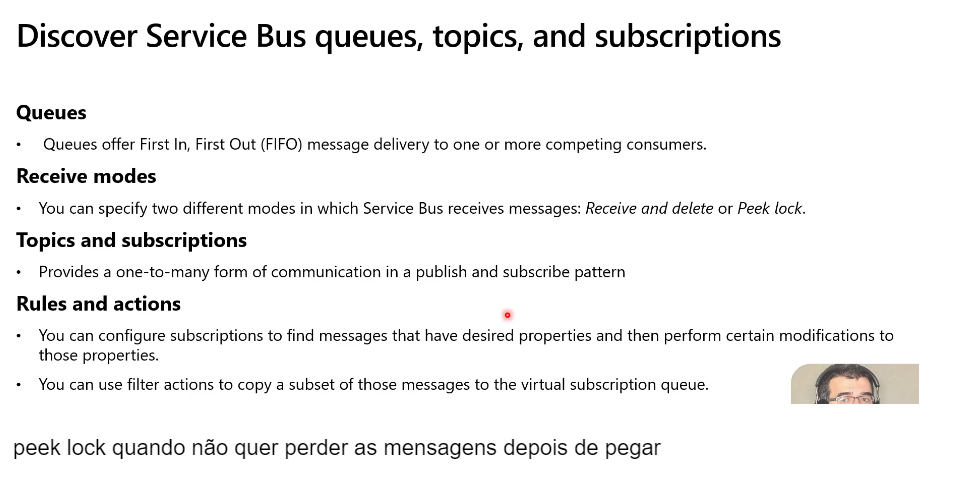

# Desenvolver soluções de computação do Azure (25–30%)

## Implementar soluções conteinerizadas

- [ ] ***Criar e gerenciar imagens de contêiner para soluções***
- [ ] ***Publicar uma imagem no Registro de Contêiner do Azure.***
- [ ] ***Executar contêineres usando a Instância de Contêiner do Azure***
- [ ] ***Criar soluções usando os Aplicativos de Contêiner do Azure***

- O Azure oferece diferentes opções de contêineres
- você pode optar por implantar seu aplicativo da web em um contêiner Docker ao criar o recurso do aplicativo
- você pode criar um recurso Kubernetes, que é complexo de configurar e usar, mas é poderoso e pode ser bem dimensionado
- você pode criar uma instância de contêiner do Azure, que é uma maneira simples e rápida de colocar um contêiner em execução, mas não é tão poderosa quanto o Kubernetes e não é escalonável
- você pode criar seu projeto de aplicativo da web em uma imagem e enviá-lo para um diretório diretamente do VS
- você pode então implantar essas imagens em um aplicativo Web do Azure, uma VM com Docker em execução, uma instância de contêiner do Azure, etc.
- Imagem Docker: um pacote de sistema operacional, dependências e código que pode ser usado para criar e executar uma instância de contêiner

### Registro de contêiner do Azure(ACR)

O ARC (Registro de Contêiner do Azure) é um serviço de registro do Docker gerenciado e privado com base no Docker Registry 2.0 de software livre. Criar e manter registros de contêiner do Azure para armazenar e gerenciar suas imagens privadas de contêiner Docker.

| Camada   | Descrição                                                                                                                                                                                                                                                                                                                                                                                                                                                                                  |
| -------- | -------------------------------------------------------------------------------------------------------------------------------------------------------------------------------------------------------------------------------------------------------------------------------------------------------------------------------------------------------------------------------------------------------------------------------------------------------------------------------------------- |
| Basic    | Um ponto de entrada de otimização de custo para desenvolvedores aprendendo sobre o Registro de Contêiner do Azure. Os registros Básicos têm os mesmos recursos de programação que os Standard e Premium (como a integração de autenticação do Microsoft Entra, exclusão de imagense webhooks). No entanto, o armazenamento incluído e a taxa de transferência de imagem são mais apropriados para cenários de uso mais baixos.                                               |
| Standard | Os registros Standard oferecem os mesmos recursos do Básico, com maior armazenamento incluído e taxa de transferência de imagem. Registros Standard devem atender às necessidades da maioria dos cenários de produção.                                                                                                                                                                                                                                                                |
| Premium  | Os registros Premium fornecem a maior quantidade de armazenamento incluído e operações simultâneas, permitindo cenários de alto volume. Além de uma taxa de transferência de imagens mais alta, o Premium adiciona recursos como a replicação geográfica para gerenciar um só registro em várias regiões, a relação de confiança de conteúdo para a assinatura de marca de imagem e o link privado com pontos de extremidade privados para restringir o acesso ao registro. |

- um local para publicar imagens de contêineres privados
- DockerHub, por outro lado, é um registro público
- um registro de contêiner é um recurso

* **Redundância de zona:** a redundância de zona, um recurso da camada de serviço Premium, usa zonas de disponibilidade do Azure para replicar seu registro para um mínimo de três zonas separadas em cada região habilitada.

**DockerFile**

```powershell
# Use the .NET 6 runtime as a base image
FROM mcr.microsoft.com/dotnet/runtime:6.0

# Set the working directory to /app
WORKDIR /app

# Copy the contents of the published app to the container's /app directory
COPY bin/Release/net6.0/publish/ .

# Expose port 80 to the outside world
EXPOSE 80

# Set the command to run when the container starts
CMD ["dotnet", "MyApp.dll"]
```

Comand

```powershell
az acr task create --registry $ACR_NAME --name example1 --context https://github.com/$GIT_USER/acr-build-helloworld-node.git#main --file taskmulti.yaml --git-access-token $GIT_PAT
```

### Instância de contêiner do Azure (ACI)

As ACI (Instâncias de Contêiner do Azure) oferecem a maneira mais rápida e simples de executar um contêiner no Azure sem precisar gerenciar nenhuma máquina virtual ou adotar um serviço de nível superior.

- uma instância de contêiner é um recurso no qual uma imagem de contêiner implantada é executada
- A ACI é mais rápida de implantar do que um serviço de aplicativo, mas os serviços de aplicativo têm mais recursos (backups, escalabilidade, etc.)

```powershell
az container create --resource-group az204-aci-rg \
    --name mycontainer \
    --image mcr.microsoft.com/azuredocs/aci-helloworld \
    --ports 80 \
    --dns-name-label $DNS_NAME_LABEL --location <myLocation>
```

#### Grupos de contêineres

O recurso de nível superior em Instâncias de Contêiner do Azure é um  *grupo de contêineres* . Um grupo de contêineres é uma coleção de contêineres que são agendados no mesmo computador host. Os contêineres de um grupo de contêineres compartilham ciclo de vida, recursos, rede local e volumes de armazenamento. Conceitualmente, ele é semelhante a um *pod* no Kubernetes.


Grupos com vários contêineres são úteis nos casos em que você deseja dividir apenas uma tarefa funcional em várias imagens de contêiner. Essas imagens podem ser fornecidas por equipes diferentes e têm outros requisitos de recursos.

Os exemplos de uso podem incluir:

* Um contêiner que atende a um aplicativo Web e um contêiner efetuando pull do conteúdo mais recente do controle do código-fonte.
* Um contêiner de aplicativo e um contêiner de log. O contêiner de log coleta logs e métricas de saída do aplicativo principal e grava-as em armazenamento de longo prazo.
* Um contêiner de aplicativo e um contêiner de monitoramento. O contêiner de monitoramento faz uma solicitação periódica ao aplicativo para garantir que ele esteja em execução e respondendo corretamente e emite um alerta em caso negativo.
* Um contêiner de front-end e um contêiner de back-end. O de front-end pode servir a um aplicativo Web, com o de back-end executando um serviço para recuperar dados.

| Política de reinicialização | Descrição                                                                                                                                                                                                                            |
| ------------------------------ | -------------------------------------------------------------------------------------------------------------------------------------------------------------------------------------------------------------------------------------- |
| `Always`                     | Os contêineres no grupo de contêineres sempre são reiniciados. Essa é a configuração**padrão** aplicada quando nenhuma política de reinicialização é especificada na criação do contêiner.                         |
| `Never`                      | Os contêineres no grupo de contêineres nunca são reiniciados. Os contêineres são executados no máximo uma vez.                                                                                                                   |
| `OnFailure`                  | Os contêineres no grupo de contêineres são reiniciados somente quando o processo executado no contêiner falha (quando ele termina com um código de saída diferente de zero). Os contêineres são executados pelo menos uma vez. |

```powershell
az container create \
    --resource-group myResourceGroup \
    --name mycontainer \
    --image mycontainerimage \
    --restart-policy OnFailure
```

> **Observação**
>
> Atualmente, os grupos com vários contêineres dão suporte apenas aos contêineres do Linux. Para contêineres do Windows, as Instâncias de Contêiner do Azure dão suporte apenas à implantação de uma única instância.


Comando para utilizar variaveis

```powershell
az container create \
    --resource-group myResourceGroup \
    --name mycontainer2 \
    --image mcr.microsoft.com/azuredocs/aci-wordcount:latest 
    --restart-policy OnFailure \
    --environment-variables 'NumWords'='5' 'MinLength'='8'\
```

**Limitações**

* O compartilhamento de Arquivos do Azure só pode ser montado para contêineres do Linux.
* A montagem de volume de compartilhamento de arquivos do Azure requer que o contêiner Linux seja executado como  *raiz* .
* As montagens de volume de compartilhamento de Arquivos do Azure são limitadas ao suporte a CIFS.

**Exemplo montar volumes**


```powershell
az container create --resource-group $ACI_PERS_RESOURCE_GROUP --name hellofiles 
--image mcr.microsoft.com/azuredocs/aci-hellofiles --dns-name-label aci-demo 
--ports 80 --azure-file-volume-account-name $ACI_PERS_STORAGE_ACCOUNT_NAME 
--azure-file-volume-account-key $STORAGE_KEY 
--azure-file-volume-share-name $ACI_PERS_SHARE_NAME --azure-file-volume-mount-path /aci/logs/
```

### Aplicativos de Contêiner do Azure

permitem que você execute microsserviços e aplicativos conteinerizados em uma plataforma sem servidor que é executada sobre Serviço de Kubernetes do Azure. Os tipos de uso comuns dos Aplicativos de Contêiner do Azure incluem:

* Implantação de pontos de extremidade de API
* Hospedagem de aplicativos de processamento em segundo plano
* Manipulação de processamento controlado por eventos
* Execução de microsserviços

Você pode:

* Executar várias revisões de contêiner e gerenciar o ciclo de vida do aplicativo de contêiner.
* Dimensionar automaticamente os aplicativos com base em qualquer gatilho de escala com suporte do KEDA. A maioria dos aplicativos pode ser dimensionada como zero (os aplicativos que são dimensionados em carga de CPU ou de memória não podem ser dimensionados como zero).
* Habilitar a entrada HTTPS sem precisar gerenciar outra infraestrutura do Azure.
* Dividir o tráfego entre várias versões de um aplicativo para implantações azuis/verdes e cenários de teste A/B.
* Usar a entrada interna e a descoberta de serviço para pontos de extremidade somente internos seguros com a descoberta de serviço interna baseada em DNS.
* Crie microsserviços com [Dapr](https://docs.dapr.io/concepts/overview/) e acesse seu valioso conjunto de APIs.
* Executar contêineres de qualquer registro, público ou privado, incluindo o Docker Hub e o ACR (Registro de Contêiner do Azure).
* Usar a extensão da CLI do Azure, o portal do Azure ou os modelos do ARM para gerenciar os aplicativos.
* Fornecer uma rede virtual existente ao criar um ambiente para os aplicativos de contêiner.
* Gerenciar os segredos com segurança diretamente no aplicativo.
* Monitorar logs usando o Azure Log Analytics.


Os motivos para implantar aplicativos de contêiner no mesmo ambiente incluem situações em que você precisa:

* Gerenciar serviços relacionados
* Implantar aplicativos diferentes na mesma rede virtual
* Instrumentar aplicativos [Dapr](https://docs.dapr.io/concepts/overview/) que se comunicam por meio da API de invocação de serviço do Dapr
* Fazer com que os aplicativos compartilhem a mesma configuração de Dapr
* Fazer com que os aplicativos compartilhem o mesmo workspace do Log Analytics

Os motivos para implantar aplicativos de contêiner em ambientes diferentes incluem situações em que você deseja garantir:

* Dois aplicativos nunca compartilham os mesmos recursos de computação
* Dois aplicativos Dapr não se comunicam por meio da API de invocação de serviço do Dapr


**Exemplo de criação**

```powershell

//Instale a extensão dos Aplicativos de Contêiner do Azure para a CLI.
az extension add --name containerapp --upgrade

//Remova o namespace Microsoft.App.
az provider register --namespace Microsoft.App

//Registre o provedor Microsoft.OperationalInsights para o workspace do Log Analytics do Azure Monitor se ele ainda não tiver sido usado.
az provider register --namespace Microsoft.OperationalInsights

//Defina as variáveis de ambiente 
myRG=az204-appcont-rg
myLocation=<location>
myAppContEnv=az204-env-$RANDOM

// grupo de recursos para seu aplicativo de contêiner
az group create \
    --name $myRG \
    --location $myLocation

//Crie um ambiente
az containerapp env create \
    --name $myAppContEnv \
    --resource-group $myRG \
    --location $myLocation

//Implante uma imagem de contêiner de aplicativo 
az containerapp create \
    --name my-container-app \
    --resource-group $myRG \
    --environment $myAppContEnv \
    --image mcr.microsoft.com/azuredocs/containerapps-helloworld:latest \
    --target-port 80 \
    --ingress 'external' \
    --query properties.configuration.ingress.fqdn

//Ao definir --ingress como external, você torna as solicitações públicas disponíveis do aplicativo de contêiner. O comando retorna um link para acessar seu aplicativo.

```

Os Aplicativos de Contêiner do Azure gerenciam os detalhes do Kubernetes e orquestração de contêineres para você. Os contêineres nos Aplicativos de Contêiner do Azure podem usar o runtime, a linguagem de programação ou a pilha de desenvolvimento de sua preferência.


Exemplo de modelo ARM

```powershell
"containers": [
  {
       "name": "main",
       "image": "[parameters('container_image')]",
    "env": [
      {
        "name": "HTTP_PORT",
        "value": "80"
      },
      {
        "name": "SECRET_VAL",
        "secretRef": "mysecret"
      }
    ],
    "resources": {
      "cpu": 0.5,
      "memory": "1Gi"
    },
    "volumeMounts": [
      {
        "mountPath": "/myfiles",
        "volumeName": "azure-files-volume"
      }
    ]
    "probes":[
        {
            "type":"liveness",
            "httpGet":{
            "path":"/health",
            "port":8080,
            "httpHeaders":[
                {
                    "name":"Custom-Header",
                    "value":"liveness probe"
                }]
            },
            "initialDelaySeconds":7,
            "periodSeconds":3
// file is truncated for brevity
```


Os Aplicativos de Contêiner do Azure têm as seguintes limitações:

* **Contêineres com privilégios** : os Aplicativos de Contêiner do Azure não podem executar contêineres com privilégios. Se o programa tentar executar um processo que requer acesso raiz, o aplicativo dentro do contêiner apresentará um erro de runtime.
* **Sistema operacional** : são necessárias imagens de contêiner baseadas em Linux (`linux/amd64`).

## Implementar Aplicativos Web do Serviço de Aplicativo do Azure

- [ ] ***Criar um Aplicativo de API do Serviço de Aplicativo do Azure***
- [ ] ***Habilitar o registro em log de diagnóstico***
- [ ] ***Implantar o código em um aplicativo Web***
- [ ] ***Definir configurações de aplicativo Web, incluindo Transport Layer Security (TLS), configurações de API e cadeias de conexão***
- [ ] ***Implementar o dimensionamento automático***

- O Serviço de Aplicativo no Linux não é compatível com o tipo de preço Compartilhado.
- Quando for implantar seu aplicativo Web, ao executar na camada Standard ou superior do Plano do Serviço de Aplicativo do Azure, você poderá usar um slot de implantação separado em vez do slot de produção padrão
- um aplicativo da web reside dentro de um plano de serviço de aplicativo
- ACU: unidade de computação do Azure
- WebJobs

  - uma tarefa em segundo plano anexada a um aplicativo da web
  - funciona de acordo com um cronograma
  - como uma função do Azure acionada por temporizador
- slots de implantação

  - uma maneira de hospedar várias instâncias de um aplicativo em uma única instância de aplicativo da web
- Dica CLI: use `get-command *{search term}*` para procurar um comando
- Kudu

  - ao publicar seu aplicativo da web, você obtém um URL para o site Kudu do seu aplicativo
  - o site Kudu fornece detalhes sobre seu aplicativo
    - arquivos
    - fluxos de log
    - scripts de implantação
  - no site você pode usar um shell Bash ou PowerShell na nuvem para navegar nos diretórios
- Criação de Slots de implantação

  - Criar Ressource Group
  - Criar Service Plan
  - Criar WebApp
  - Criar Slot
- Existem dois tipos de identidades gerenciadas:

  * Atribuído pelo sistema: alguns serviços do Azure permitem-lhe ativar uma identidade gerida diretamente numa instância de serviço. Quando você habilita uma identidade gerenciada atribuída ao sistema, é criada uma identidade no Azure AD que está vinculada ao ciclo de vida dessa instância de serviço. Assim, quando o recurso é eliminado, o Azure elimina automaticamente a identidade para si. Por design, apenas esse recurso do Azure pode usar esta identidade para solicitar tokens do Azure AD.
  * Atribuído pelo utilizador: também pode criar uma identidade gerida como um recurso autónomo do Azure. Você pode criar uma identidade gerenciada atribuída ao usuário e atribuí-la a uma ou mais instâncias de um serviço do Azure. No caso de identidades geridas atribuídas pelo utilizador, a identidade é gerida separadamente dos recursos que a utilizam.
- O *tipo de preço* de um plano de serviço de aplicativo determina quais recursos do serviço de aplicativo que você obtém e quanto você paga pelo plano. Há algumas categorias de tipos de preços:

  * **Computação compartilhada** : **grátis** e  **compartilhada** , os dois tipos base, executam um aplicativo na mesma máquina virtual do Azure como outros aplicativos do serviço de aplicativo, incluindo aplicativos de outros clientes. Essas camadas alocam cotas de CPU a cada aplicativo que é executado nos recursos compartilhados e os recursos não podem ser escalados horizontalmente.
  * **Computação dedicada** : as camadas  **Básica** ,  **Standard** ,  **Premium** , **PremiumV2** e **PremiumV3** executam os aplicativos nas VMs dedicadas do Azure. Somente os aplicativos no mesmo plano do serviço de aplicativo compartilham os mesmos recursos de computação. Quanto maior o nível, mais instâncias de máquina virtual estão disponíveis para a sua expansão.
  * **Isolado** : as camadas **Isolada** e **IsoladaV2** executam VMs do Azure em Redes Virtuais do Azure dedicadas. Ele fornece isolamento de rede na parte superior do isolamento de computação para seus aplicativos. Ele fornece a capacidade máxima de expansão.
- Um plano de serviço de aplicativo ou app service plan **define um conjunto de recursos de computação para um aplicativo Web ser executado** . Quando você cria um plano de serviço de aplicativo em uma determinada região (por exemplo, Europa Ocidental), um conjunto de recursos de computação é criado para esse plano nessa região

Os Planos de Serviço de Aplicativo do Azure são um plano de serviço no Azure para hospedagem de aplicativos Web. Ele fornece uma maneira de alocar recursos, dimensionar e gerenciar o ambiente no qual os aplicativos são executados. Aqui estão alguns conceitos-chave:

Plano de Serviço de Aplicativo: Este é um contêiner lógico que define um conjunto de aplicativos Web do Serviço de Aplicativo que compartilham os mesmos recursos de computação e definições de configuração. O Plano de Serviço de Aplicativo inclui recursos de computação (como instâncias de máquinas virtuais), sistemas operacionais, recursos de rede, etc. Um Plano de Serviço de Aplicativo pode hospedar um ou mais aplicativos Web, aplicativos API, aplicativos móveis ou serviços de back-end.

Aumentar/diminuir escala: ao alterar o tamanho do Plano de Serviço de Aplicativo, você pode dimensionar o aplicativo verticalmente. Isso significa que você pode ajustar o tamanho dos recursos computacionais de acordo com as necessidades da sua aplicação, por exemplo, atualizar de Compartilhado para Básico, Padrão, Premium, etc.

Scale Out/In: Ao alterar o número de instâncias, você pode dimensionar seu aplicativo horizontalmente. Isso significa que você pode aumentar ou diminuir o número de instâncias de máquinas virtuais executando seu aplicativo em resposta a alterações no tráfego e na carga.

Modelo de preços: os Planos de Serviço de Aplicativo têm diferentes níveis de preços, cada um oferecendo diferentes recursos e recursos de computação. A camada Compartilhada é adequada para desenvolvimento e testes de baixo tráfego, enquanto as camadas Standard, Premium e Advanced Enhanced são adequadas para aplicações de produção em maior escala.

Regiões e disponibilidade específicas: os Planos de Serviço de Aplicações podem ser criados em regiões específicas do Azure para garantir alta disponibilidade e baixa latência para a sua aplicação.

No geral, os Planos de Serviço de Aplicativos do Azure fornecem uma maneira conveniente de gerenciar e ajustar os recursos de computação para atender às necessidades de desempenho e escalabilidade do seu aplicativo. Ao utilizar Planos de Serviço de Aplicações, pode gerir eficazmente os recursos com base nas necessidades da sua aplicação, ao mesmo tempo que minimiza a complexidade de manutenção e configuração.

Comandos para criar recursos

```powershell

//Realiza o Login
login az

//Cria um grupo de recursos
az group create --location westeurope --name (nome do seu grupo)

//Criar o app service plan
az appservice plan create --name (nome do seu projeto)--resource-group (nome escolhido no passo anterior)--sku S1

//cria seu webapp
az webapp create --name (nome do app)--resource-group (nome do grupo de recursos)--plan (nome do plano criado no passo anterior)

//publicação do recurso
az webapp deployment source config --name (nome do seu projeto)--resource-group (seu resource group)--repo-url (url do seu projeto no git) --branch master --manual-integration

```

## Implementar Funções do Azure

* [ ] Criar e configurar um aplicativo do Azure Functions
* [ ] Implementar associações de entrada e de saída
* [ ] Implementar gatilhos função usando operações de dados, temporizadores e webhooks

# Desenvolver para armazenamento do Azure (15–20%)

## Desenvolver soluções que usam o Azure Cosmos DB

* [ ] Executar operações em contêineres e itens usando o SDK
* [ ] Definir o nível de consistência adequado para operações
* [ ] Implementar notificações do feed de alterações

### CosmosDB

- banco de dados não SQL e não relacional
- Cosmos garante latência abaixo de 10ms
- é mais caro que um Azure Table Storage
- tipos de contas CosmosDB

  - Núcleo (SQL)
    - Documentos JSON armazenados
    - você pode usar SQL para acessar os dados
      -MongoDB
    - geralmente usado para migrar um banco de dados existente
  - Cassandra
    - também geralmente usado para migração
  - Tabela Azure
    - diferente de uma tabela numa conta de armazenamento do Azure
  - Gremlin (Gráfico)
    - baseado em nós, arestas/relações
- você pode tornar a conta do CosmosDB com redundância geográfica (o que significa que você pagará o dobro pelo armazenamento)
- se você escolher o armazenamento com redundância geográfica, poderá permitir que a região emparelhada faça gravações na conta (dobra novamente o custo da conta)
- duas cópias de backups de banco de dados são armazenadas gratuitamente para você

  - você pode então escolher entre armazenamento com redundância local ou geográfica
- depois de ter uma conta

  - você pode criar contêineres e explorá-los através do Data Explorer
  - você pode criar controles de acesso baseados em funções
  - você pode adicionar/remover regiões de leitura na página replicada
    - a sincronização e replicação acontecem automaticamente
  - na página de chaves você pode visualizar suas chaves de acesso primária e secundária, tanto as chaves de leitura-gravação quanto as de leitura, bem como o URI da conta
- criando um contêiner

  - você pode escolher um nível RU/segundo (400+)
  - 1 RU/s: a quantidade de computação necessária para ler 1kb de dados em um segundo
  - quanto maior o RU, mais o banco de dados custará
  - você pode optar por compartilhar esses RU/s em todos os contêineres do seu banco de dados
  - chave de partição: o campo pelo qual o CosmosDB dividirá fisicamente seus dados
- consistência padrão (como os dados são sincronizados nas regiões replicadas)

  - forte: os dados são sincronizados automaticamente sempre que são alterados
  - sem estado limitado: você define o tempo máximo permitido antes que os dados sejam sincronizados
  - sessão: este é o padrão, os clientes na sessão atual verão seus dados sincronizados em quaisquer regiões que estejam acessando, mas para regiões que não estão sendo acessadas no momento, há atrasos indefinidos entre as sincronizações
  - prefixo consistente: não há garantia de quando os dados serão sincronizados, mas sempre estarão na ordem correta
  - eventual: sem garantia de quando os dados serão sincronizados e sem garantia de ordem
- É recomendável usar o modelo de push porque você não precisará se preocupar em sondar o feed de alterações para alterações futuras, armazenar o estado da última alteração processada e outros benefícios.

  Feed é usado para auditoria

  - Com um modelo de push, o processador do feed de alterações envia o trabalho por push para um cliente que tem lógica de negócios para processar esse trabalho. No entanto, a complexidade na verificação do trabalho e no armazenamento do estado do último trabalho processadp é tratada dentro do processador de feed de alterações.
  - Com um modelo de pull, o cliente precisa efetuar pull do trabalho do servidor. O cliente, nesse caso, não só tem lógica de negócios para processar o trabalho, mas também armazenar o estado do último trabalho processado, lidando com o balanceamento de carga entre vários clientes que processam trabalhos em paralelo e manipulando erros.
  - Há quatro componentes principais de implementação do processador de feed de alterações:

  1. **Contêiner monitorado:** o contêiner monitorado tem os dados com base nos quais o feed de alterações é gerado. Todas as inserções e atualizações no contêiner monitorado são refletidas no feed de alterações do contêiner.
  2. **Contêiner de concessão:** o contêiner de concessão atua como um armazenamento de estado e coordena o processamento do feed de alterações em vários trabalhos. O contêiner de concessão pode ser armazenado na mesma conta que o contêiner monitorado ou em uma conta separada.
  3. **Instância de computação** : uma instância de computação hospeda o processador do feed de alterações para escutar as alterações. A depender da plataforma, ela pode ser representada por uma VM, um pod kubernetes, uma instância do Serviço de Aplicativo do Azure, um computador físico real. Ela tem um identificador exclusivo referenciado como o nome da instância em todo este artigo.
  4. **Delegado:** o delegado é o código que define o que você, desenvolvedor, deseja fazer com cada lote de alterações lido pelo processador do feed de alterações.

## Desenvolver soluções que usam o Armazenamento de Blobs do Azure

* [ ] Definir e recuperar as propriedades e os metadados
* [ ] Executar operações em dados usando o SDK apropriado
* [ ] Implementar políticas de armazenamento e gerenciamento do ciclo de vida de dados
* [ ] Implementar hospedagem de site estático

### Azure storage accounts

- contas de armazenamento gerenciadas são as contas que o Azure cria quando você cria uma VM, abre o Cloud Shell pela primeira vez, etc., você não as cria diretamente
- contas de armazenamento não gerenciadas são aquelas que você cria como recursos para o que quiser
  - nível de desempenho premium
    - você paga mais por GB de armazenamento, mas menos pelas transações em si
    - usado para dados que você acessa centenas de vezes por segundo
  - na aba de rede, ao criar uma conta de armazenamento, você pode escolher
    - acessar a conta através de um endpoint público
      - você ainda precisaria de uma chave de acesso privada para atingir o endpoint
    - acesse a conta através de uma rede específica e então escolha/crie uma rede virtual
    - um endpoint privado não pode ser acessado pela Internet, mesmo com uma chave de acesso ou via VPN
  - contêineres de blob
    - tipos de recipientes
      - privado: sem acesso de leitura anônimo
      - blob: acesso de leitura anônimo para todos os blobs
      - container: acesso de leitura anônimo para todo o container
  - acessando dados da conta de armazenamento
    - nas propriedades da conta de armazenamento, há uma URL para cada um dos tipos de contêiner (blob, arquivo, fila, tabela, Data Lake, site estático)

      - se você tiver o armazenamento com redundância geográfica somente leitura ativado, também obterá um endpoint secundário para cada tipo
    - em chaves de acesso você encontrará as chaves de acesso que permitem acesso total a toda a conta

      - atingir o ponto final de um arquivo/conta/contêiner com a chave fornecerá o arquivo/conta/contêiner
    - na assinatura de acesso compartilhado (SAS), você pode selecionar permissões e um período de tempo em que os arquivos/contêineres podem ser acessados e, em seguida, gerar um token que pode ser anexado aos URLs do terminal
- assinatura de acesso partilhado (SAS) permite-lhe fornecer acesso limitado a uma conta de armazenamento, contentor ou blob válido por um período de tempo especificado. 

# Implementar a segurança do Azure (20–25%)

## Implementar autenticação e autorização de usuário

* [ ] Autenticar e autorizar usuários usando a plataforma Microsoft Identity
* [ ] Autenticar e autorizar usuários e aplicativos utilizando o Microsoft Entra ID
* [ ] Criar e implementar assinaturas de acesso compartilhado
* [ ] Implementar soluções que interagem com o Microsoft Graph

## Implementar soluções seguras do Azure

* [ ] Dados seguros de configuração de aplicativo usando a Configuração de Aplicativos ou o Azure Key Vault
* [ ] Desenvolver um código que use chaves, segredos e certificados armazenados no Azure Key Vault
* [ ] Implementação de identidades gerenciadas para recursos do Azure

# Monitorar, solucionar problemas e otimizar soluções do Azure (15–20%)

## Implementar o cache para soluções

* [ ] Configurar políticas de cache e expiração para Cache do Azure para Redis
* [ ] Implementar padrões de cache de aplicativos seguros e otimizados, incluindo dimensionamento de dados, conexões, criptografia e expiração
* [ ] Implementar pontos de extremidade e perfis da Rede de Distribuição de Conteúdo do Azure

### Redis

| Padrão                                 | Descrição                                                                                                                                                                                                                                                                                                                                                                                                                                                                                                                                                                                                                                  |
| --------------------------------------- | -------------------------------------------------------------------------------------------------------------------------------------------------------------------------------------------------------------------------------------------------------------------------------------------------------------------------------------------------------------------------------------------------------------------------------------------------------------------------------------------------------------------------------------------------------------------------------------------------------------------------------------------- |
| Cache de dados                          | Os bancos de dados geralmente são grandes demais para serem carregados diretamente em um cache. É comum usar o padrão[cache-aside](https://learn.microsoft.com/pt-br/azure/architecture/patterns/cache-aside) para carregar dados no cache, somente conforme necessário. Quando o sistema faz alterações nos dados, ele também pode atualizar o cache, que será distribuído a outros clientes.                                                                                                                                                                                                                                         |
| Cache de conteúdo                      | Muitas páginas da Web são geradas com base em modelos que usam conteúdo estático, como cabeçalhos, rodapés e faixas. Esses itens estáticos não devem ser alterados com frequência. O uso de um cache na memória fornece acesso rápido a conteúdo estático em comparação com armazenamentos de dados de back-end.                                                                                                                                                                                                                                                                                                              |
| Repositório de sessão                 | Esse padrão é geralmente usado com carrinhos de compras e outros dados de histórico do usuário que um aplicativo Web pode associar aos cookies do usuário. O armazenamento de muitas informações em um cookie pode ter um efeito negativo no desempenho conforme o tamanho do cookie aumenta e é passado e validado com cada solicitação. Uma solução típica usa o cookie como uma chave para consultar os dados em um banco de dados. Usar um cache na memória, como o Cache do Azure para Redis, para associar informações a um usuário é muito mais rápido do que interagir com um banco de dados relacional completo. |
| Enfileiramento de mensagens e trabalhos | Aplicativos geralmente adicionam tarefas a uma fila quando as operações associadas à solicitação levam tempo para serem executadas. As operações de execução mais longa são enfileiradas para serem processadas em sequência, muitas vezes por outro servidor. Esse método de adiamento do trabalho é chamado de enfileiramento de tarefas.                                                                                                                                                                                                                                                                                     |
| Transações distribuídas              | Às vezes, os aplicativos exigem uma série de comandos em relação a um armazenamento de dados de back-end para serem executados como uma única operação atômica. Todos os comandos devem ter êxito ou ser revertidos para o estado inicial. O Cache do Azure para Redis dá suporte à execução de um lote de comandos como uma única[transação](https://redis.io/topics/transactions).                                                                                                                                                                                                                                            |

| Camada           | Descrição                                                                                                                                                                                                                                                                                 |
| ---------------- | ------------------------------------------------------------------------------------------------------------------------------------------------------------------------------------------------------------------------------------------------------------------------------------------- |
| Basic            | Um cache do software livre do Redis em execução em uma VM. Esta camada não tem nenhum contrato de nível de serviço (SLA) e é ideal para o desenvolvimento/teste e cargas de trabalho não críticas.                                                                                  |
| Standard         | Um cache do software livre do Redis em execução em duas VMs em uma configuração replicada.                                                                                                                                                                                              |
| Premium          | Caches do software livre do Redis de alto desempenho. Essa camada oferece maior taxa de transferência, latência mais baixa, melhor disponibilidade e mais recursos. Os caches Premium são implantados em VMs mais avançadas em comparação com as VMs para caches Básico ou Standard. |
| Enterprise       | Caches de alto desempenho fornecidos pelo software Redis Enterprise da Redis Labs. Essa camada dá suporte a módulos do Redis, incluindo RediSearch, RedisBloom e RedisTimeSeries. Além disso, ela oferece uma disponibilidade ainda maior do que a camada Premium.                       |
| Enterprise Flash | Caches grandes econômicos do software Redis Enterprise da Redis Labs. Esta camada estende o armazenamento de dados do Redis para a memória não volátil, que é mais em conta que DRAM em uma VM. Ele reduz o custo de memória geral por GB.                                            |

## Solucionar problemas de soluções usando o Application Insights

* [ ] Configurar um aplicativo ou serviço para usar o Application Insights
* [ ] Monitorar e analisar métricas, logs e rastreamentos
* [ ] Implementar alertas e testes Web do Application Insights

### Application Insights

Monitora aplicações e gera métricas e logs,

Trabalha com telemetria e logs das aplicações

é um recurso do Azure Monitor

Pode disparar alertas(pode gerar ações), analisa a aplicação e gera sugestões

Pode cadastrar testes para ser observado para caso de problemas de acordo com a região

Snapshot do problema que pode ser gerado(alto custo)

Pode juntar varios logs diferentes e agregar valores para usar uma regra de escalanomento por exemplo

Pode checar se a aplicação está bem ou se a aplicação dizer se está bem para o aplication insights

Map APlicaion insigths - precisa dar um tempo para ele conseguir gerar o mapa de erros


# Conectar a e consumir serviços do Azure e serviços de terceiros (15–20%)

## Implementar a gestão da API

* [ ] Criar uma instância do Gerenciamento de API do Azure
* [ ] Criar e documentar APIs
* [ ] Configurar o acesso às APIs
* [ ] Implementar políticas para APIs

## Desenvolver soluções baseadas em evento

* [ ] Implementar soluções que usam Grade de Evento Azure
* [ ] Implementar soluções que usam o Hub de Evento Azure

A principal diferença entre a Azure Event Grid e o Azure Event Hub é o tipo de eventos que tratam. A Azure Event Grid lida com eventos discretos, que são ocorrências únicas que representam uma mudança de estado ou uma ação. Por exemplo, um arquivo sendo criado, um recurso sendo atualizado ou uma mensagem sendo enviada. O Azure Event Hub lida com eventos de telemetria, que são fluxos contínuos de dados que representam medições ou observações. Por exemplo, leituras de temperatura, atualizações de localização ou eventos de clique.

Outra diferença é o mecanismo de entrega que eles usam. A Azure Event Grid utiliza entrega push, o que significa que envia os eventos para os subscritores assim que estiverem disponíveis. O Azure Event Hub utiliza entrega pull, o que significa que os subscritores têm de retirar os eventos do serviço ao seu próprio ritmo.

### **Event Grid**

Gera, recebe mensagens e manda para quem quer - removê apos entregar

### **Event hub**

armazenado de mensagens na sequencia e quando alguem quer le da forma que achar melhor, do ponto que quiser

event hub tudo controlado por rbac

## Desenvolver soluções baseadas em mensagem

* [ ] Implementar soluções que usam o Barramento de Serviços Azure
* [ ] Implementar soluções que usam filas de Armazenamento de Fila Azure

### Service Bus

Fila é lida na hora

Ordem é que importa

Service Bus - ele me entrega a mensagem, um leitor por vez, permite ter subscriber, descarta mensagens duplicadas

peek lock quando não quer perder as mensagens depois de pegar




### Storage Queue

Storage Queue (simples e mais barata e poucos recursos) - pode ter múltiplos leitores ao mesmo tempo, não descarta mensagens duplicadas, melhor para gerar logs das mensagens melhor que o service bus, ordem não importa tanto (usar por exemplo em comunicação de microsserviços)

Storage Queue - sempre trabalha com rest

Autenticação feita pelo storage account


